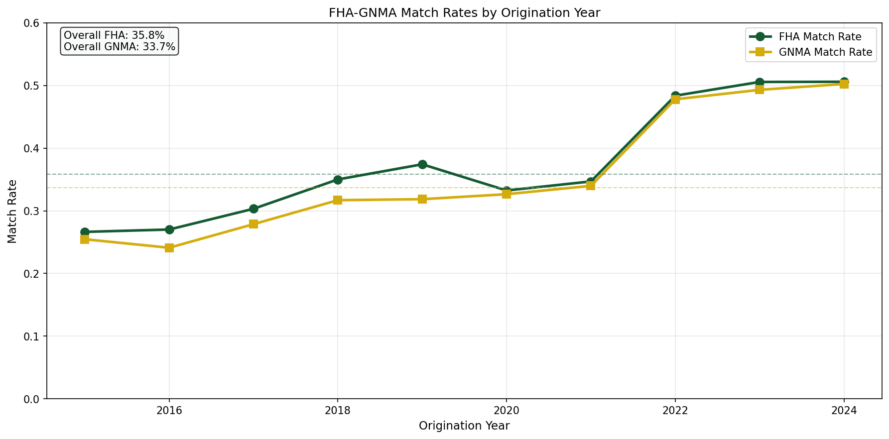
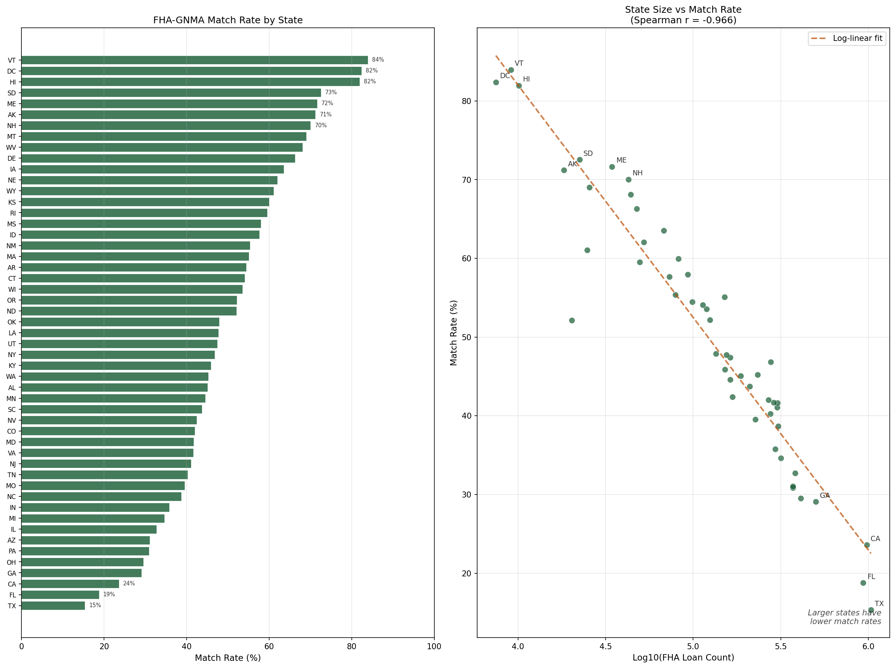
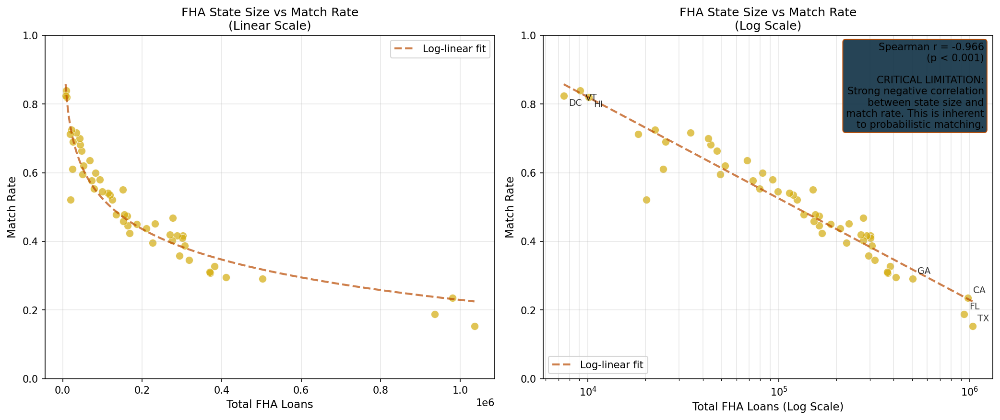
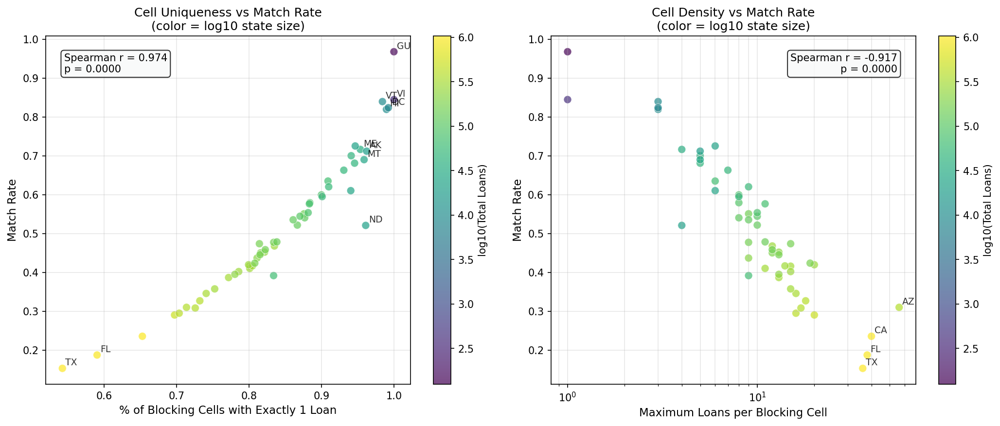
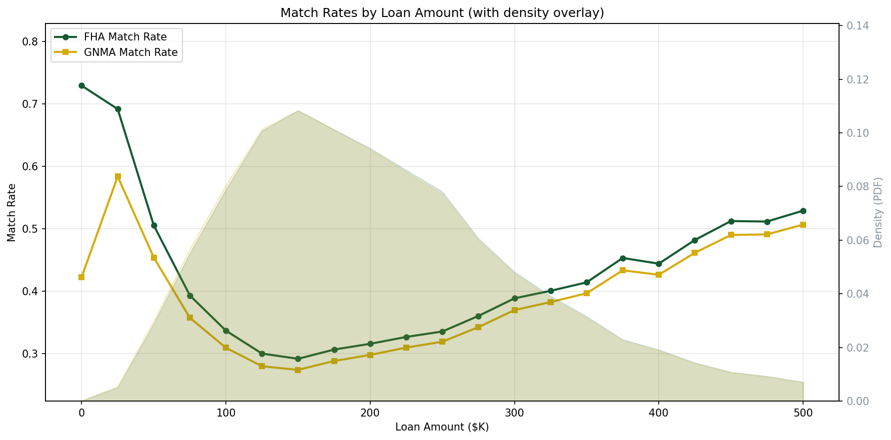
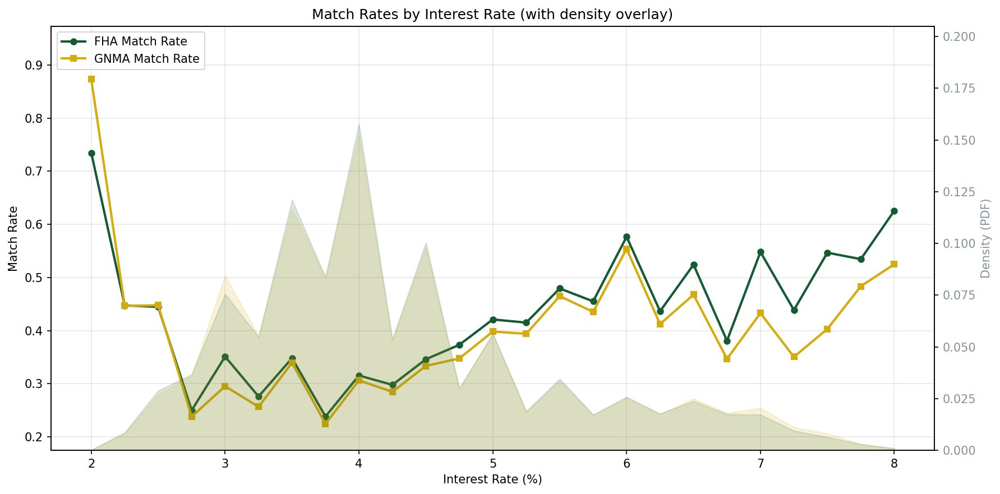
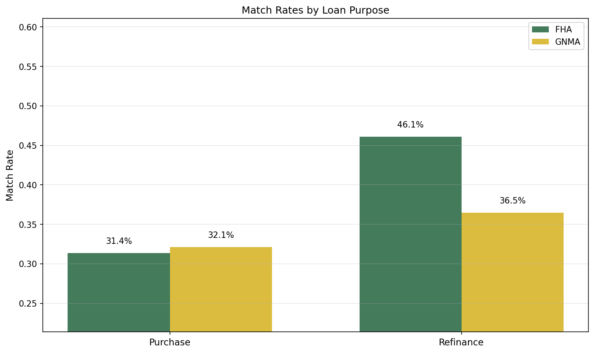

# FHA-GNMA Matching Report

## Overview

This document describes a probabilistic matching workflow that links FHA endorsement records with GNMA loan-level disclosure data. Since GNMA data lacks FHA Case Numbers, matching relies on loan characteristics.

The matching enables researchers to combine FHA administrative data (including detailed borrower and property information) with GNMA securitization data (including pool-level characteristics and monthly performance data).

## Data Sources

- **FHA Endorsement Data**: FHA single-family endorsement records containing loan details at the time of FHA insurance endorsement
- **GNMA Loan-Level Disclosure**: GNMA dailyllmni disclosure data containing loan-level information for loans securitized in Ginnie Mae pools

## Key Discovery: GNMA Truncates Loan Amounts

**Critical finding**: GNMA documentation states that Original Principal Balance is "truncated to the thousandths place" (i.e., floored to the nearest $1,000).

Example from documentation: "a value of 123456.78 will be disclosed as 123000.00"

This means the GNMA amount equals the FHA amount floored to the nearest $1,000, and the difference between FHA and GNMA amounts is always in the range [0, 999]. This is truncation (floor), NOT rounding.

This finding was verified empirically: 100% of matched loans have the difference equal to the FHA amount modulo 1000.

## Methodology

### Blocking Strategy

To avoid explosive join sizes, the matching uses exact-key blocking on:

1. **State**: 2-character code
2. **Origination Year**: From FHA endorsement date and GNMA Loan Origination Date
3. **Loan Purpose**: Purchase vs Refinance
4. **Loan Amount (thousands)**: Floor of amount divided by 1,000
5. **Rate Bucket**: Interest rate rounded to nearest 0.125%
6. **Month**: With tolerance for timing differences

### Month Tolerance

FHA endorsement typically occurs 0-2 months after GNMA origination date:
- **Round 1 (Strict)**: Month difference in [0, 1]
- **Round 2 (Relaxed)**: Month difference in [-1, 3]

### Multi-Round Matching

1. **Round 1**: Strict tolerances capture high-confidence matches
2. **Round 2**: Relaxed month tolerance on remaining unmatched records

### Mutual Best-Match Selection

When multiple candidates exist within a blocking cell:
1. Compute match score based on exact amount/rate differences
2. Rank each pair within FHA and GNMA groups
3. Keep only mutual best matches (rank=1 for both sides)
4. Drop ties where multiple pairs have identical best scores

## Output

| Column | Type | Description |
|--------|------|-------------|
| FHA_Index | String | FHA unique identifier |
| gnma_loan_id | String | GNMA Disclosure Sequence Number |
| match_round | Int | 1=strict, 2=relaxed |
| match_score | Float | Quality score (lower=better) |

## Results

### Overall Match Rates (2015-2024, All States)

| Metric | Value |
|--------|-------|
| FHA Records | 10,889,993 |
| GNMA FHA Records | 11,586,182 |
| Matched Pairs | 3,903,836 |
| FHA Match Rate | 35.8% |
| GNMA Match Rate | 33.7% |
| Round 1 Matches | 3,476,106 (89.0%) |
| Round 2 Matches | 427,730 (11.0%) |

### Match Rates by State

Match rates vary dramatically by state size:

| State | FHA Loans | Match Rate |
|-------|-----------|------------|
| GU | 125 | 96.8% |
| VI | 419 | 84.5% |
| VT | 9,098 | 84.0% |
| DC | 7,465 | 82.4% |
| ... | ... | ... |
| CA | 980,197 | 23.6% |
| FL | 935,840 | 18.8% |
| TX | 1,035,891 | 15.3% |

## Issues and Limitations

### Critical Limitation: State Size Bias

**Correlation between log(state size) and match rate: Spearman r = -0.907**

Match rates decrease approximately 22 percentage points for every 10x increase in state loan volume.

#### Cause

Larger states have more loans falling into the same blocking cells (same state + year + purpose + amount_thousands + rate_bucket + month). When multiple FHA loans and multiple GNMA loans share identical blocking keys:

- Creates many-to-many candidate matches
- Tie-breaking drops all ambiguous matches
- Larger states lose more matches to this effect

#### Evidence

| State | Unique Blocking Keys | Keys with >1 Loan | Max Loans/Key |
|-------|---------------------|-------------------|---------------|
| DC | 99.2% | 0.8% | 3 |
| MA | 87.6% | 12.4% | 9 |
| TX | 54.2% | 45.8% | 36 |

Texas has nearly half its loans in non-unique blocking cells, with up to 36 loans sharing identical keys.

#### Implications for Users

1. **Selection bias**: Matched sample over-represents small states and under-represents large states
2. **Not missing at random**: Unmatched loans are systematically different (in larger states with more common loan characteristics)
3. **Use caution** when drawing conclusions about large states from matched data
4. **Consider weighting** if using matched data for national estimates

## Validation

### Temporal Analysis

Match rates by origination year show relatively stable performance across the sample period. FHA and GNMA match rates track closely at around 33-38%. The dashed lines indicate overall averages for each perspective.

### Geographic Analysis

#### State Match Rate Map

The state choropleth reveals the dramatic geographic variation in match rates. Small states (DC, VT, ME) achieve 80%+ match rates, while large states (TX, CA, FL) fall below 25%. This pattern is a direct consequence of the blocking cell density issue.

#### State Size Bias (CRITICAL)

**This is the key validation figure.** The scatter plot demonstrates the strong negative relationship between state size and match rate:

- **Spearman r = -0.907** (p < 0.001): A near-perfect negative rank correlation
- **Large states** (TX, CA, FL): Match rates of 15-24%
- **Small states** (DC, VT, GU): Match rates of 80-97%

This is NOT a flaw in the matching methodology—it is a fundamental limitation of probabilistic matching without unique identifiers when larger states have more loans falling into identical blocking cells.

### Blocking Cell Analysis

This figure explains the mechanism behind the state size bias:

- **Left panel**: States with higher percentage of unique blocking cells (cells containing exactly 1 loan) achieve higher match rates
- **Right panel**: States with larger maximum cell sizes (more loans sharing identical blocking keys) have lower match rates

Large states like Texas have up to 36 loans sharing the same blocking cell (state + year + purpose + amount_thousands + rate_bucket + month), creating many-to-many candidate matches that must be dropped during tie-breaking.

### Loan Characteristic Analysis

#### Match Rates by Loan Amount

Match rates are relatively stable across the loan amount distribution. The shaded regions show the density of loans in FHA and GNMA data. Both perspectives show consistent ~35% match rates across amount bins, indicating no systematic bias toward small or large loans.

#### Match Rates by Interest Rate

Match rates by interest rate show consistent performance across the rate distribution. The density overlays indicate where most loans fall (3.5-5.5% range for this sample period). Match rates are stable regardless of rate level.

#### Match Rates by Loan Purpose

Match rates by loan purpose (Purchase vs Refinance) show similar performance for both categories. This indicates the matching methodology does not favor one loan purpose over another.

### Summary

The validation analyses reveal both the strengths and critical limitations of the FHA-GNMA matching:

**Strengths:**
1. **Temporal stability**: Match rates are consistent across years (33-38%)
2. **Loan characteristics**: Match rates are stable across:
   - Loan amount distribution
   - Interest rate levels
   - Loan purpose (purchase vs refinance)
3. **Round 1 dominance**: 89% of matches come from strict Round 1 criteria

**Critical Limitation:**
1. **State size bias**: Spearman r = -0.907 indicates very strong negative correlation between state size and match rate
2. **Selection bias**: Matched sample over-represents small states (DC, VT) and under-represents large states (TX, CA, FL)
3. **Not missing at random**: Unmatched loans are systematically from larger states with more common loan characteristics

**Implications for Users:**
- The matched sample is NOT a random sample of FHA-GNMA loans
- Use caution when analyzing large-state patterns from matched data
- Consider weighting if using matched data for national estimates
- Document this limitation when reporting results

## Future Improvements

Potential ways to improve match rates in large states:

1. **Add blocking keys**: Use zip code or county if available in GNMA data
2. **Probabilistic tie-breaking**: Randomly select among ties instead of dropping all
3. **Additional scoring features**: Use loan term, property type, or other fields
4. **Iterative matching**: Match unique pairs first, then re-attempt ambiguous ones
