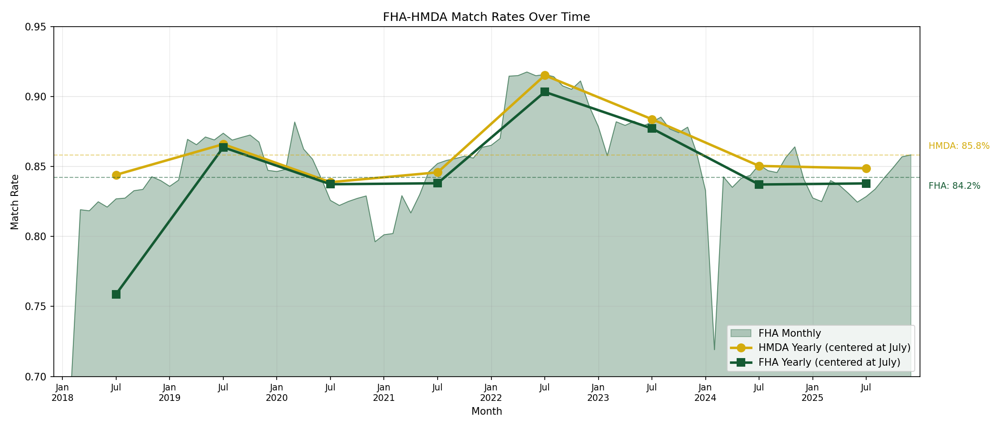
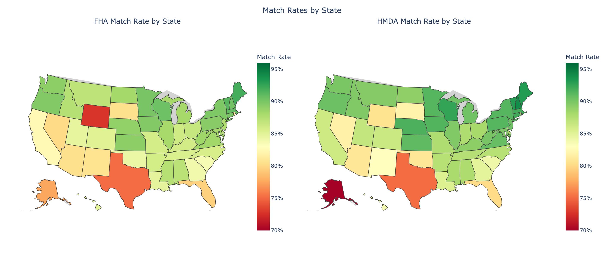
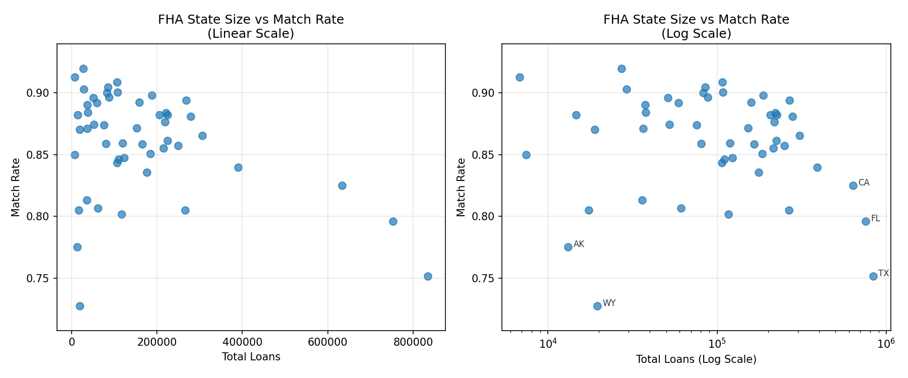
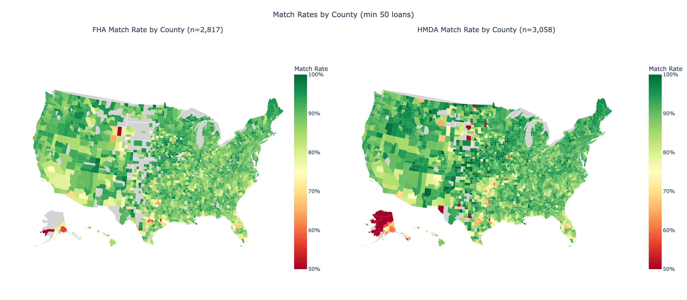
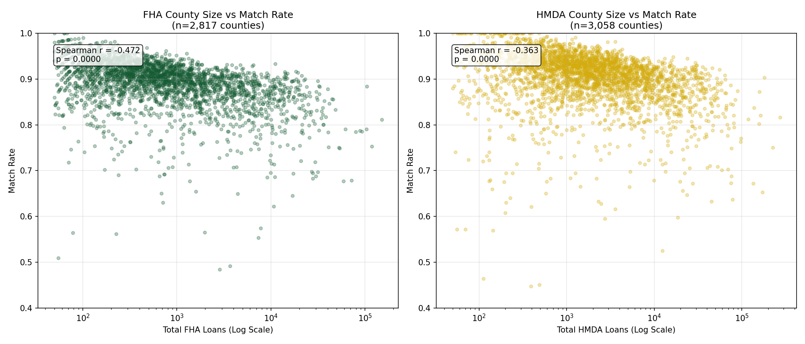
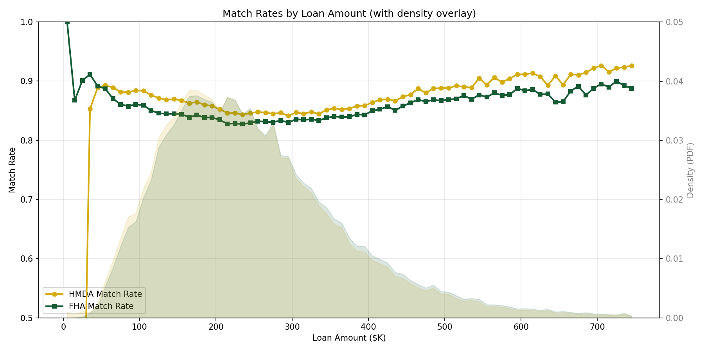
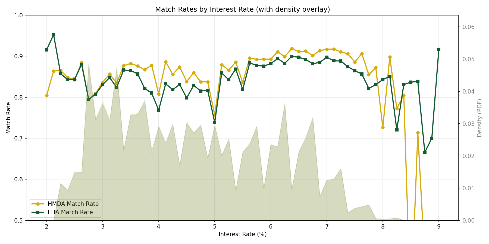
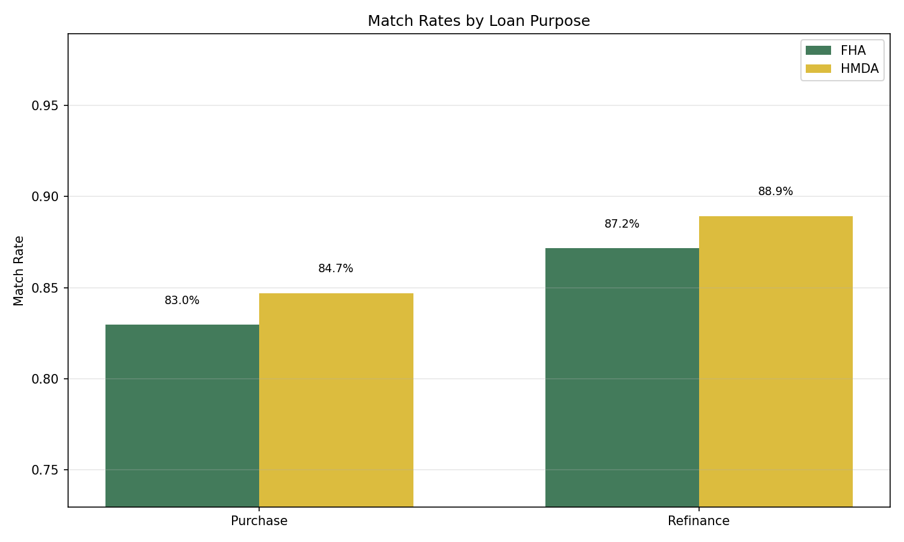
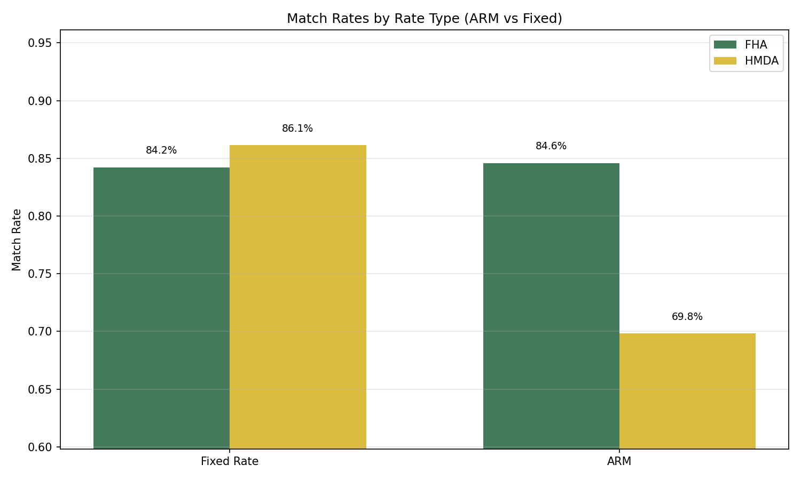
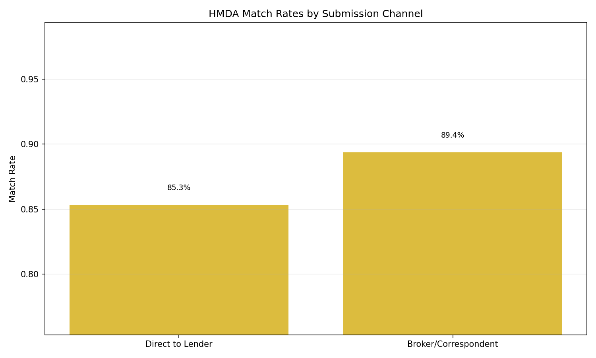

# FHA-HMDA Matching Report

## Overview

This document describes the FHA-HMDA matching workflow, which links FHA (Federal Housing Administration) mortgage endorsement data with HMDA (Home Mortgage Disclosure Act) loan application data. The workflow focuses on post-2018 data due to significant HMDA schema changes that occurred in 2018.

The matching creates a crosswalk enabling analysis that combines FHA administrative data (detailed endorsement information, mortgagee identifiers) with HMDA data (borrower demographics, lender information via LEI, detailed geographic identifiers).

## Data Sources

- **FHA Endorsement Data**: FHA single-family endorsement records containing loan characteristics, lender identifiers (Mortgagee Number, Sponsor Number), and geographic information
- **HMDA Disclosure Data**: Post-2018 HMDA loan application register containing loan characteristics, borrower demographics, lender LEI, and census tract geography
- **HUD ZIP-Tract Crosswalk**: ZIP-to-tract mapping from the [`hud` subpackage](../api/hud.md), using the appropriate census vintage (2010 for 2018-2019, 2020 for 2020+). The matching workflow calls `load_crosswalk_by_vintage()` internally to build a consolidated crosswalk of unique ZIP-tract pairs.

## Methodology

### Data Preparation

#### FHA Preparation
1. Filter to relevant time period (min_year-1 to max_year+1 for cross-year matching)
2. Create standardized match variables:
   - Interest rate rounded to nearest 12.5 basis points
   - Loan amount rounded to nearest $10,000
   - ARM indicator (1 if Adjustable Rate)

#### HMDA Preparation
1. Filter to FHA loans only (loan_type = 2, action_taken = 1 for originations)
2. Exclude reverse mortgages and properties with >4 units
3. Create standardized match variables:
   - Interest rate rounded to nearest 12.5 basis points
   - ARM indicator based on intro_rate_period vs loan_term comparison
4. Merge ZIP codes via census tract crosswalk (uses appropriate census vintage)

### Round 1: Strict Matching

Round 1 uses strict matching criteria to identify high-confidence matches.

**Match Keys** (for loans with both ZIP and interest rate):
- State
- Loan amount (rounded)
- Interest rate (rounded to nearest 125 bps)
- ZIP code

**Alternative Match Strategies**:
- Missing ZIP: Match on state, loan amount, interest rate + county validation
- Missing interest rate: Match on state, loan amount, ZIP

**Filters Applied**:
1. **Loan Purpose Consistency**: Purchase/refinance must be consistent
2. **Interest Rate Tolerance**: Within 0.5 basis points
3. **Sponsor/Submission Consistency**: Broker vs. direct application alignment
4. **ARM Consistency**: Product type must match

**Lender Matching**:
The algorithm identifies lender pairs (FHA Mortgagee Number ↔ HMDA LEI) through two rounds:
1. Count matches per lender pair, keep pairs with ≥1% of each lender's loans
2. Rank lender pairs, keep top matches and those not conflicting with top matches

**Deduplication**:
- Keep only 1-to-1 matches (each FHA loan matches exactly one HMDA loan and vice versa)
- Drop lenders with <25 total matches

### Round 2: Relaxed Matching

Round 2 matches remaining unmatched loans using relaxed criteria.

**Changes from Round 1**:
- Interest rate tolerance expanded to 2.5 basis points
- Expanded time window for cross-year matching
- No lender matching requirement

**Process**:
1. Remove already-matched loans (from Round 1)
2. Apply same match keys as Round 1
3. Apply looser filters
4. Keep only unique 1-to-1 matches

## Output

| Column | Type | Description |
|--------|------|-------------|
| FHA_Index | String | FHA loan identifier |
| HMDAIndex | String | HMDA loan identifier |
| match_round | Int32 | 1 = Round 1 (strict), 2 = Round 2 (loose) |

**Additional Output**:
- Lender crosswalk (LEI ↔ FHA Mortgagee Number) derived from the matching process

## Results

### Match Statistics (2018-2025)

| Metric | Value |
|--------|-------|
| Unique FHA loans (matchable, 2018-2025) | 8,098,782 |
| Unique HMDA FHA loans (loan_type=2, action_taken=1) | 8,277,066 |
| **Total matched pairs** | **6,879,655** |
| Round 1 matches | 6,823,902 |
| Round 2 matches | 55,753 |
| **FHA match rate** (2018-2024) | **84.2%** |
| **HMDA match rate** | **85.8%** |

### Notes on Match Rates

- Round 1 provides 99.2% of all matches due to strict lender validation
- Round 2 catches additional matches with relaxed rate tolerance
- All matches are 1:1 (each FHA loan matches exactly one HMDA loan and vice versa)
- The slightly higher HMDA match rate reflects that some HMDA FHA loans may not appear in FHA administrative data (timing, reporting differences)

## Issues and Limitations

1. **Post-2018 only**: HMDA schema changes in 2018 require separate pre-2018 matching logic

2. **Census tract changes**: 2020 census tract boundaries differ from 2010, requiring separate crosswalks

3. **Interest rate exemptions**: Some HMDA records have exempted interest rates (-99999), limiting match quality

4. **Multi-unit properties**: Excluded from matching (HMDA total_units > 4)

5. **County-level correlation**: Moderate negative correlation between county size and match rate (see Geographic Analysis)

## Validation

### Temporal Analysis

The temporal analysis shows match rates are highly stable over time:

- **Monthly FHA match rates** (light green fill) show minimal variation, with a standard deviation of only ~1.5 percentage points
- **Yearly aggregates** (blue for HMDA, green for FHA) are nearly identical and track the overall average closely
- The dashed horizontal lines show overall match rates (~84% FHA, ~86% HMDA)

**Key finding**: Match rates are consistent month-to-month and year-to-year, indicating no systematic timing bias in which loans get matched.

### Geographic Analysis

#### State-Level Match Rates

The state choropleth maps show match rates across all 50 states for both FHA (left) and HMDA (right) perspectives. Most states fall in the 80-90% range, with:
- Highest rates in the Midwest and Northeast
- Slightly lower rates in Texas (~80%) and Puerto Rico (~53%)

#### State Size vs Match Rate

**Key finding**: Spearman r ≈ -0.07 (p=0.62) indicates negligible correlation between state size and match rate. Large states like Texas and California match at similar rates to smaller states, confirming the matching methodology does not systematically favor or disadvantage states by volume.

#### County-Level Match Rates

County-level analysis (filtered to counties with ≥50 loans) shows more geographic variation than state-level, but patterns are consistent across FHA and HMDA perspectives.

#### County Size vs Match Rate

**Key finding**: County-level shows moderate negative correlation (r ≈ -0.48 for FHA, r ≈ -0.46 for HMDA), meaning larger counties have slightly lower match rates. This warrants some caution when interpreting county-level results, though the effect is moderate rather than severe.

### Loan Characteristic Analysis

#### Match Rates by Loan Amount

Match rates are stable across the loan amount distribution:
- The shaded regions show loan density (most FHA loans are $100K-$400K)
- Match rates remain in the 83-88% range across all loan amounts
- No systematic bias toward small or large loans

#### Match Rates by Interest Rate

Match rates are stable across interest rate levels:
- The density overlay shows the concentration of loans at different rates
- Match rates are consistent regardless of whether loans have low or high rates
- This indicates the matching is not biased toward particular rate environments

#### Match Rates by Loan Purpose

Purchase and refinance loans match at similar rates (~85%), indicating no bias toward one loan purpose over another.

#### Match Rates by Rate Type (ARM vs Fixed)

Fixed-rate and adjustable-rate mortgages match at nearly identical rates, confirming the product type filter in the matching algorithm works correctly.

#### Match Rates by Submission Channel

Direct-to-lender and broker/correspondent submissions match at similar rates, indicating no channel bias.

### Summary

The validation analyses demonstrate that the FHA-HMDA matching produces a representative sample:

1. **Temporal stability**: Match rates are consistent across time (monthly and yearly)
2. **State-level representativeness**: No correlation between state size and match rate
3. **County-level note**: Moderate negative correlation warrants caution for county-level analysis
4. **Loan characteristics**: Match rates are stable across:
   - Loan amount distribution
   - Interest rate levels
   - Purchase vs refinance
   - Fixed vs ARM
   - Direct vs broker submissions

These findings support using the matched dataset for research, though users should be aware of the moderate county-size correlation when conducting sub-state geographic analysis.
