# FHFA-HMDA Matching Report

## Overview

This document describes the FHFA-HMDA matching workflow, which links HMDA (Home Mortgage Disclosure Act) loan applications to FHFA (Federal Housing Finance Agency) GSE loan data from Fannie Mae and Freddie Mac. The matched dataset enables research that combines HMDA borrower / lender / tract information with GSE acquisition records.

The workflow runs in **two distinct regimes** because FHFA's data products differ structurally before and after 2018:

- **Post-2018 (acquisition years 2018-2024)** — FHFA single-family census tract (`sf_c`) files are rich, including interest rate, LTV, DTI, term, and channel. The matcher uses a 5-round design with progressively relaxed criteria. **Headline FHFA-side match rate: 89.6%.**
- **Pre-2018 (acquisition years 2009-2017)** — `sf_c` files are sparse (no rate / LTV / DTI / term / channel). Matching leans on tract + loan-type + exact income + an asymmetric loan-amount tolerance. A second round reverses FHFA's documented AMFI inflation procedure for prior-year originations to recover an additional cohort. **Headline FHFA-side match rate: 70.6%.**

Together the two pipelines cover **2009-2024 with 58.6M matched FHFA loans**.

## Data Sources

- **HMDA silver**:
  - Post-2018: `hmda/silver/loans/post2018/activity_year={year}/file_type={a|b|c}/`. The validator picks the best file_type per year (`a` > `b` > `c`).
  - Pre-2018: `hmda/silver/loans/period_2007_2017/activity_year={year}/file_type=d/`. Forces `file_type=d` (the FFIEC nationwide nonconfidential pre-2018 format).
- **FHFA silver**: `fhfa/silver/sf_c/sf_c_{year}.parquet`. The post-2018 schema has ~66 columns; pre-2018 has ~41 columns and lacks the rate / LTV / DTI / term / channel fields used in post-2018 matching.

## Methodology

### Post-2018 workflow (5 rounds)

The post-2018 matcher uses a config-driven multi-round strategy with progressively relaxed criteria.

**Base merge keys (all rounds):**

- Census tract (11-digit FIPS)
- Loan amount (rounded)
- Loan type (conventional, FHA, VA, RD)
- Interest rate (bucketed to nearest 12.5 basis points)
- Occupancy type (owner-occupied, second home, investment)

Optional merge key (configurable per round): purchaser type (Fannie=1, Freddie=3).

**Round 1 — Strict GSE Match**

- Pre-merge: GSE purchasers only (purchaser_type ∈ {1, 3}).
- Merge: census tract + purchaser + rate (same year).
- Post-merge: demographics required, DTI filter, rate tolerance ±0.05.
- Purpose: capture highest-confidence matches where HMDA purchaser_type indicates direct GSE sale.

**Round 2 — Relaxed Same-Year**

- Pre-merge: all purchaser types (0, 1, 3, 5+).
- Merge: census tract + rate (no purchaser, same year).
- Post-merge: no demographics, DTI filter.
- Purpose: catch loans where HMDA purchaser_type is uninformative (e.g., pt=9 for loans subsequently sold to GSEs).

**Round 3 — Cross-Year with Quality Filter**

- Pre-merge: all purchaser types.
- Merge: census tract + rate, cross-year (FHFA year ≥ HMDA year).
- Post-merge: demographics required, DTI filter.
- Post-unique: tighter tolerances (rate ±0.01, term ±6 months).
- Purpose: GSE acquisition in a year following HMDA origination.

**Round 4 — No Rate Match with Moderate Filters**

- Pre-merge: all purchaser types.
- Merge: no rate in join keys (same year).
- Post-merge: moderate rate tolerance (±0.20), moderate term (±12), demographics required, DTI filter, loan purpose filter.
- Purpose: catch loans with missing or fuzzy interest rates but strong matches on other fields.

**Round 5 — Cross-Vintage Tract Bridge (2021/2022 boundary)**

- Pre-merge: all purchaser types.
- Merge: census tract + rate, cross-year, with FHFA's 2020-vintage tract translated to its 2010-vintage candidates via the Census Bureau `tab20_tract20_tract10_natl` relationship file. Fires only when HMDA year ≤ 2021 and FHFA year ≥ 2022 (the only direction the matcher crosses the vintage boundary, since the workflow does FHFA year ≥ HMDA year only).
- Post-merge: same filters as round 3.
- Post-unique: looser than round 3 (rate ±0.125, term ±12) because bridged matches sit in redrawn tracts where key-set ambiguity is higher and rate disagreement is wider.
- Purpose: recover cross-year matches that round 3 silently lost when the 2020 Census redrew tract boundaries. Roughly 16–27% of HMDA-2021 ↔ FHFA-2022 tract GEOIDs do not line up directly; this round bridges them. Recovery on the current crosswalk is ~146K additional matches (~3.8% of FHFA 2022), implemented via the `vintage_bridge=True` flag on `MergeConfig` and the `_apply_vintage_bridge` helper. See `investigations/reports/investigation_fhfa_hmda_vintage_bridge_2026-05-15.md` for the analysis.

**Filter types** (post-2018):

- Pre-merge filters: applied to HMDA pool before join.
- Post-merge filters: rate / term tolerances; demographics required; first-lien requirement (`date_of_mortgage_note == 1`); loan purpose pairing; DTI consistency.
- Post-unique filters: optional tighter tolerances after the 1:1 constraint to prune low-quality matches.

**DTI encoding** (both datasets identical):

- Binned codes: 10 (<20%), 20 (20-30%), 30 (30-36%), 50 (50-60%), 60 (>60%).
- Numeric values: 36-49 reported as actual integers.
- Missing codes: 99 (FHFA), NA / Exempt (HMDA).

**Deduplication**: all rounds enforce 1:1 unique matching with mutual best-match scoring for duplicate resolution.

### Pre-2018 workflow (2 rounds)

The pre-2018 schema is too sparse for the post-2018 fingerprint. The pre-2018 matcher uses two rounds.

**Round 1 — Same-year, exact income**

- Pool: HMDA[Y] originated loans (`action_taken=1`) with `purchaser_type ∉ {0, 2, 4}` (`pt=0` "not sold in calendar year" optionally retained via `strict_purchaser_type=False`; Ginnie / Farmer Mac never reach Enterprise files). FHFA[Y] GSE acquisitions (`enterprise_flag ∈ {1, 2}`).
- Merge: `census_tract` (11-digit FIPS) + `loan_type` ↔ `Federal Guarantee` + exact `income` ↔ `Borrower(s) Annual Income`.
- Asymmetric loan-amount tolerance: `0 ≤ HMDA - FHFA ≤ max($2,000, 1% × HMDA)`. Justification: `Acquisition UPB` is post-paydown ≤ origination amount; paydown scales with balance.
- Asymmetric exclusion filters (drop physically impossible pairings rather than requiring equality on noisy fields):
  - Enterprise/purchaser pairing: drop FNMA × HMDA pt=3 and FHLMC × HMDA pt=1.
  - Loan purpose: drop FHFA purchase × HMDA refi/home-improvement; drop FHFA refi × HMDA purchase.
  - Gender: drop pt mismatches between `co_applicant_sex` and `Co-Borrower Gender`.
  - Occupancy: drop owner-occupied × non-owner.
  - Property type: drop 1-4 family × multifamily.
- 1:1 dedup on (FHFA record, HMDA loan).

**Round 2 — 1-year lag, AMFI-deflated income**

- Why: FHFA `Borrower(s) Annual Income` is **AMFI-inflated** for prior-year originations (per the 2016 SF File C dictionary, Field 11): `published_income = round_to_$1k(orig_income × AMFI_acq / AMFI_orig)`, where AMFI is the local-area HUD median family income for the loan's MSA / county. R1's exact-income merge therefore silently drops the prior-year cohort — about 8% of FHFA acquisitions per year.
- Pool: HMDA[Y-1] originated loans with `purchaser_type ∉ {1, 2, 3, 4}` (drop direct-GSE sales which would belong to FHFA[Y-1] not FHFA[Y]) against FHFA[Y] residual after R1.
- Merge: tract + loan_type. Same exclusion filters and asymmetric loan-amount tolerance as R1.
- AMFI deflation: build an MSA × year AMFI panel from FHFA silver `local_area_median_income`. Per pair, deflate FHFA income to origination year:

  ```
  fhfa_deflated = round_to_$1k(FHFA × AMFI_orig_msa / AMFI_acq_msa)
  ```

  Require `|fhfa_deflated - HMDA_income| ≤ $1,000`. The round-to-$1k-after-scaling matches FHFA's published rounding procedure: 91% of true prior-year matches reverse to within $1k, 99% within $2k.
- 1:1 dedup, then append to the R1 crosswalk.

**Pre-2018 implementation notes**

- **Synthetic `hmda_row` index**: HMDA 2017 silver has `sequence_number` entirely null, so the natural 4-tuple loan key is non-unique that year (5,762 unique IDs across 6.36M rows). The workflow assigns a global row index `hmda_row` over the cleaned HMDA frame and uses it as the dedup key. Logged as a warning when natural-key collisions are detected.
- **Census-tract code change**: HMDA and FHFA both transition from 2000 → 2010 Census tracts at the 2011/2012 boundary. Same-year matches are unaffected (both sides use the same vintage in any given year). Round 2 across that boundary (HMDA[2011] → FHFA[2012]) has effectively no overlap and contributes ~10k matches vs ~155-165k for adjacent year pairs.
- **No rate / LTV / DTI / term / channel**: pre-2018 FHFA doesn't provide these. Demographics (race, sex, ethnicity, num_borrowers) are used as exclusion filters, not exact match keys.

## Output Schemas

### Post-2018 crosswalk (`crosswalk/fhfa_hmda/fhfa_hmda_crosswalk_2018_2024.parquet`)

| Column | Type | Description |
|---|---|---|
| `HMDAIndex` | String | HMDA unique identifier |
| `activity_year` | Int32 | HMDA activity year |
| `fhfa_year` | Int32 | FHFA acquisition year |
| `enterprise_flag` | Int64 | 1 = Fannie Mae, 2 = Freddie Mac |
| `record_number` | Int64 | FHFA record number within (year, enterprise) |
| `purchaser_type` | Int64 | HMDA purchaser type code |
| `match_round` | UInt8 | 1, 2, 3, 4, or 5 |

### Pre-2018 crosswalk (`<match_folder>/hmda_fhfa_matches_pre2018_round2.parquet`)

| Column | Type | Description |
|---|---|---|
| `year` | Int32 | FHFA acquisition year |
| `Enterprise Flag` | Int64 | 1 = Fannie Mae, 2 = Freddie Mac |
| `Record Number` | Int64 | FHFA record number within (year, enterprise) |
| `activity_year` | Int64 | HMDA reporting year |
| `respondent_id` | String | HMDA respondent ID |
| `agency_code` | Int64 | HMDA agency code |
| `sequence_number` | Int64 | HMDA sequence number (null for 2017) |
| `hmda_row` | UInt32 | Synthetic HMDA row index (the operative dedup key) |
| `match_round` | UInt8 | 1 (same-year) or 2 (1-yr-lag prior-year recovery) |

## Match Statistics

### Post-2018 — Round Breakdown

**Overall match rate**: 29,351,052 / 32,743,015 FHFA loans (**89.6%**).

| Round | Description | Matches | Cumulative FHFA |
|---|---|---:|---:|
| R1 | Strict (tract + purchaser + demographics + DTI) | 19,889,823 | 60.7% |
| R2 | Relaxed (tract + DTI, all purchaser types) | 6,348,205 | 80.1% |
| R3 | Cross-year with quality filter | 2,630,892 | 88.2% |
| R4 | No rate match + moderate filters | 338,213 | 89.2% |
| R5 | Cross-vintage tract bridge (2021/2022) | 143,919 | 89.6% |

### Post-2018 — Per-Year FHFA Match Rates

| Year | FHFA Loans | Matched | FHFA Rate |
|---|---:|---:|---:|
| 2018 | 3,239,368 | 2,590,068 | 80.0% |
| 2019 | 4,050,117 | 3,564,696 | 88.0% |
| 2020 | 8,637,597 | 7,781,622 | 90.1% |
| 2021 | 9,029,722 | 8,215,650 | 91.0% |
| 2022 | 3,837,778 | 3,531,839 | 92.0% |
| 2023 | 1,938,185 | 1,793,728 | 92.5% |
| 2024 | 2,010,248 | 1,873,449 | 93.2% |

### Pre-2018 — Round Breakdown

**Overall match rate**: 29,231,223 / 41,416,321 FHFA loans (**70.6%**); 77.3% of HMDA GSE-sold loans (denominator: HMDA `purchaser_type ∈ {1, 3}`).

| Round | Description | Matches | Share |
|---|---|---:|---:|
| R1 | Same-year, exact income | 28,505,747 | 97.5% |
| R2 | 1-yr-lag, AMFI-deflated income | 725,476 | 2.5% |

### Pre-2018 — Per-Year FHFA Match Rates

| Year | FHFA Loans | Matched | FHFA Rate | HMDA GSE Rate |
|---|---:|---:|---:|---:|
| 2009 | 5,931,117 | 3,505,217 | 59.1% | 75.0% |
| 2010 | 4,803,680 | 3,248,511 | 67.6% | 82.6% |
| 2011 | 4,336,597 | 2,812,099 | 64.8% | 79.4% |
| 2012 | 5,989,320 | 4,370,205 | 73.0% | 84.3% |
| 2013 | 5,619,812 | 3,977,591 | 70.8% | 85.2% |
| 2014 | 3,111,994 | 2,398,042 | 77.1% | 88.1% |
| 2015 | 3,720,282 | 2,841,713 | 76.4% | 87.5% |
| 2016 | 4,198,472 | 3,316,868 | 79.0% | 86.4% |
| 2017 | 3,705,047 | 2,760,977 | 74.5% | 85.4% |

### Pre-2018 — Round Contribution by Year

The 2011/2012 Census-tract code change manifests as an R2 collapse for acq year 2012:

| Year | R1 (% FHFA) | R2 (% FHFA) |
|---|---:|---:|
| 2009 | 59.1% | 0% (no HMDA[2008] in scope) |
| 2010 | 64.4% | 3.2% |
| 2011 | 61.0% | 3.8% |
| 2012 | 72.8% | **0.16%** ← Census tract boundary |
| 2013 | 69.3% | 1.5% |
| 2014 | 74.1% | 2.9% |
| 2015 | 74.9% | 1.4% |
| 2016 | 76.7% | 2.3% |
| 2017 | 72.6% | 1.9% |

## Validation

### Temporal Stability

**Post-2018:**

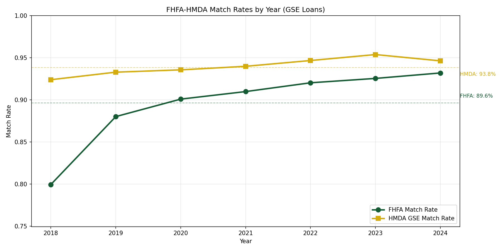

FHFA and HMDA-GSE match rates are stable and closely aligned across years. FHFA-side hovers in the 88-93% range; HMDA-GSE in the 93-94% range. Per-year HMDA-GSE rates: 92.4% (2018), 93.3% (2019), 93.6% (2020), 94.0% (2021).

**Pre-2018:**

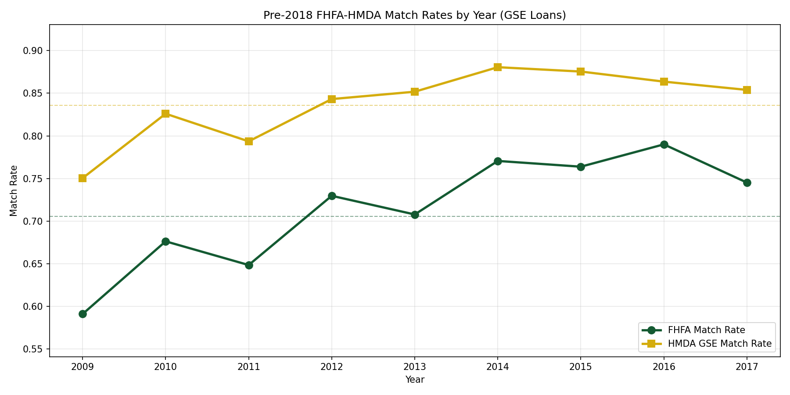

FHFA-side rates rise from 59% (2009) to 79% (2016) before dipping slightly in 2017. The 2009 low reflects post-crisis HMDA reporting noise plus the absence of R2 contribution that year. From 2014 onward both perspectives stabilize in the 74-88% range.

### Pre-2018 Round Contribution

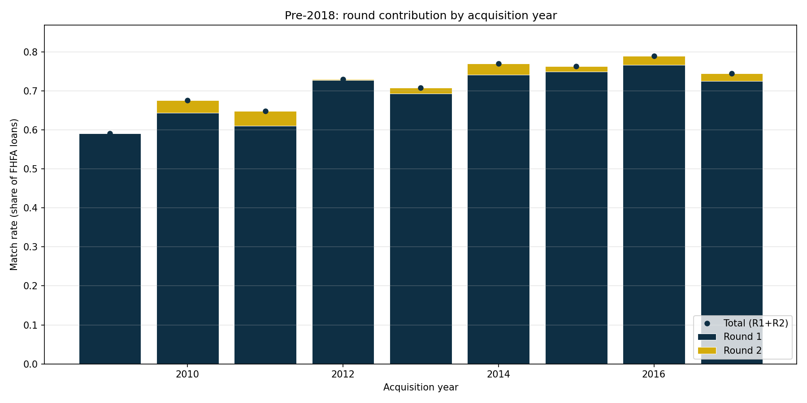

R1 dominates uniformly (≥59 pp of FHFA each year). R2 contributes 1.5-3.8 pp in years where the census tract codes align across the 1-year lag — and **collapses to 0.16 pp at the 2012 boundary** as expected from the 2000 → 2010 Census tract transition.

### Enterprise Balance

**Post-2018:**

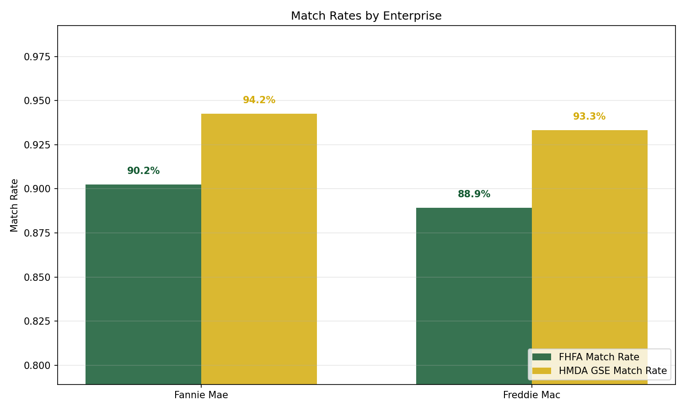

| Perspective | Fannie Mae | Freddie Mac |
|---|---:|---:|
| FHFA-side | 90.2% | 88.9% |
| HMDA GSE | 94.2% | 93.3% |

**Pre-2018:**

| Perspective | Fannie Mae | Freddie Mac | Gap |
|---|---:|---:|---:|
| FHFA-side | 70.4% | 70.8% | +0.4 pp |
| HMDA GSE | 77.1% | 77.7% | +0.6 pp |

Match rates are essentially identical between Fannie and Freddie across both eras — the workflows are unbiased between the two enterprises.

### Geographic Stability

**Post-2018 state map:**

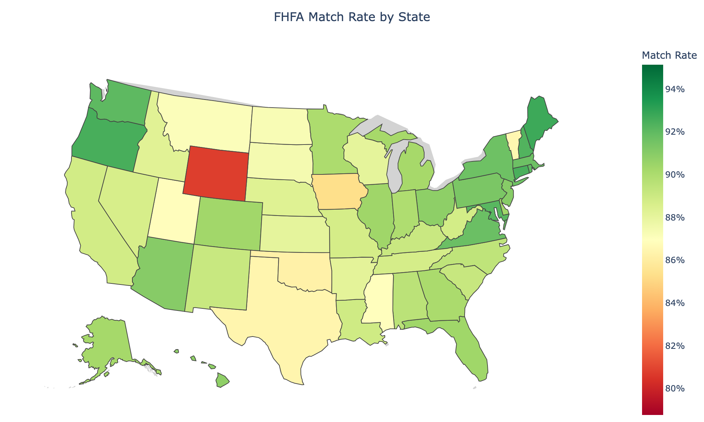

Most states fall in the 88-92% range with only minor geographic variation.

**Post-2018 state size correlation:**

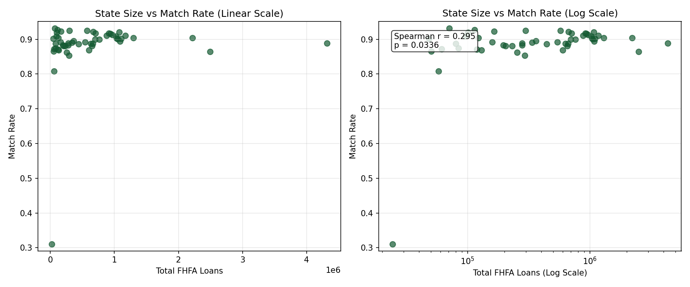

Spearman r ≈ 0.29 (p≈0.04) between state FHFA loan volume and FHFA-side match rate — a mild positive correlation. Larger states match slightly better, but the effect is small enough that no state is materially under-represented.

**Pre-2018 state map:**

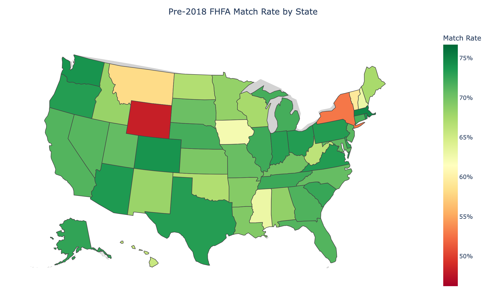

Most large states match in the 67-74% range. Notable outlier: **New York (53%)** — the gap is large enough to flag for follow-up. Likely candidates: NYC tract reporting peculiarities, condo cooperative reporting differences, or state-specific HMDA respondent patterns. The post-2018 map does not show this gap, so the issue is pre-2018 specific.

### Loan-Amount Stability

**Post-2018:**

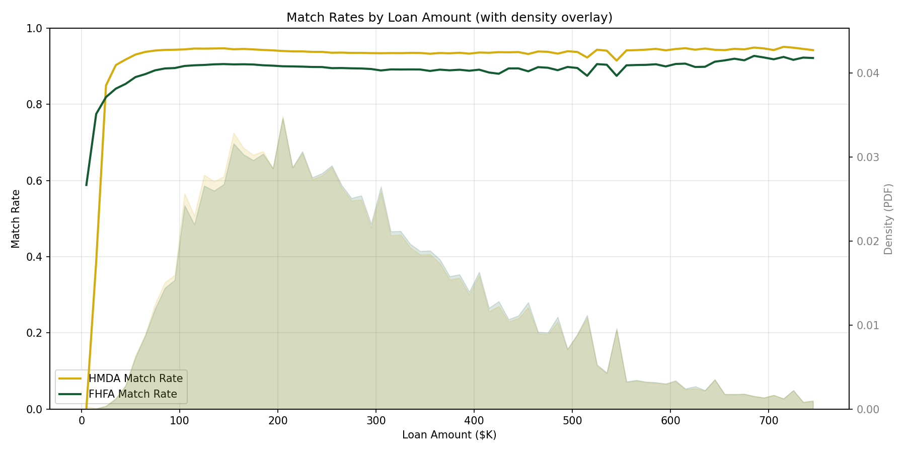

Match rates remain in the 88-92% range across the GSE-eligible amount range ($150K-$400K), with no systematic bias toward small or large loans.

**Pre-2018:**

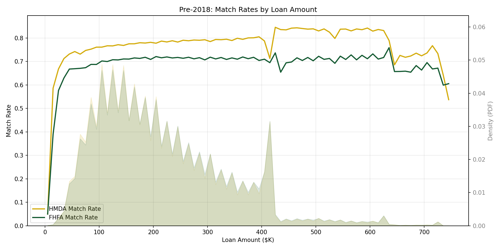

Match rates are stable across the loan-amount distribution where loan density is meaningful ($100k-$500k).

### Interest-Rate Stability (post-2018 only)

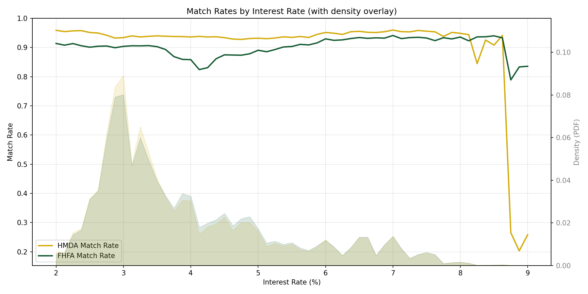

Match rates are stable across the rate distribution. Pre-2018 has no equivalent because FHFA pre-2018 doesn't carry interest rate.

### Demographic Agreement vs Random Baseline (pre-2018 only)

The key precision check on the pre-2018 workflow: matched pairs should agree on non-key variables (race, sex, ethnicity, num_borrowers) at rates well above what random pairs from the same population would. Both rates are computed from population marginals using the sum of squared marginal probabilities for the random baseline.

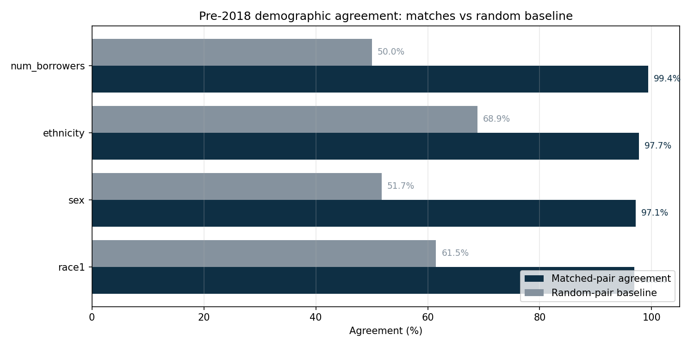

| Variable | Matched agreement | Random baseline | Lift | Ratio |
|---|---:|---:|---:|---:|
| num_borrowers | **99.4%** | 50.0% | +49.4 pp | **1.99×** |
| sex | **97.1%** | 51.7% | +45.4 pp | **1.88×** |
| ethnicity | ~97.7% | 68.9% | ~+29 pp | ~1.42× |
| race1 | **96.9%** | 61.5% | +35.4 pp | **1.58×** |

All four variables show large lifts. **num_borrowers and sex match at near-perfect rates (97-99%) against random baselines of 50-52%, ratios of 1.88-1.99×** — strong evidence that matched pairs are genuine, not collision noise.

Per-round breakdown: R2 has slightly lower agreement than R1 (race1 93.3% vs 97.0%, num_borrowers 96.4% vs 99.5%), consistent with R2 being a more permissive merge (no exact income, AMFI-deflated within $1k tolerance), but still 1.37-1.93× random.

The post-2018 workflow doesn't currently compute this diagnostic.

### AMFI-Inflation Diagnostic (pre-2018 only)

For R2 matches, compute the implied per-pair inflation ratio (`FHFA_inc / HMDA_inc`) and the expected MSA-level ratio (`AMFI_acq / AMFI_orig`). If FHFA's documented procedure is what we're reversing, these should agree pair-by-pair.

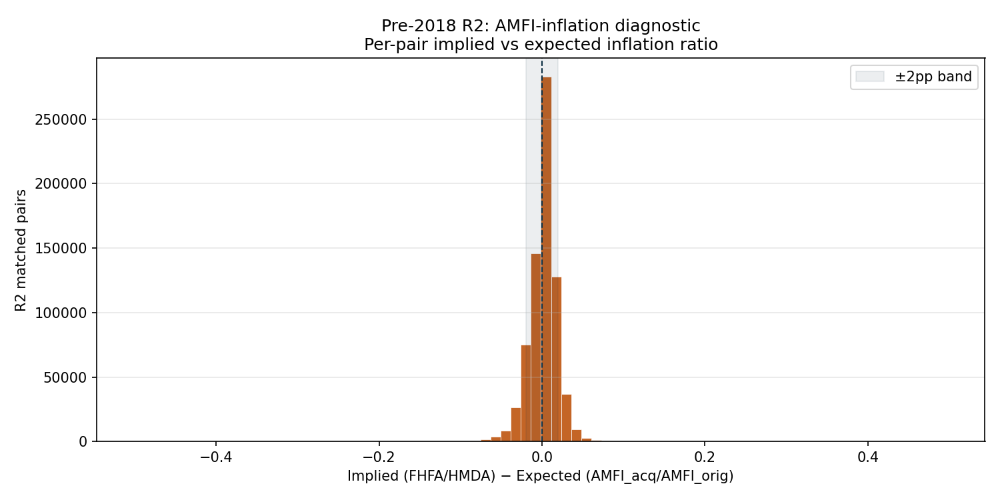

| n_pairs | Median implied | Median expected | Median residual | Mean abs residual | Within ±1pp | Within ±2pp | Within ±5pp |
|---:|---:|---:|---:|---:|---:|---:|---:|
| 725,476 | 1.000 | 1.000 | 0.000 | 0.012 | **50.8%** | **80.5%** | **98.3%** |

The implied and expected ratios agree at the median, residuals cluster tightly around 0 (mean abs residual = 1.2 pp), and **98.3% of pairs fall within ±5 pp** of the expected MSA-level inflation factor. This confirms R2 is recovering genuine prior-year originations whose published incomes follow FHFA's documented inflation procedure, not noise.

### Validation Summary

The validation analyses demonstrate that both pipelines produce representative samples:

- **Temporal stability**: post-2018 89-93% across years; pre-2018 59-79% with the lower years explained by post-crisis data quality and the Census tract code transition.
- **Enterprise balance**: Fannie / Freddie match at near-identical rates from both perspectives in both eras.
- **Geographic representativeness**: minor positive state-size correlation post-2018 (r≈0.29); pre-2018 shows a notable NY anomaly (53% vs the 67-74% national-average band).
- **Loan-characteristic stability**: match rates roughly flat across loan-amount and (post-2018) interest-rate bins.
- **Pre-2018 precision**: demographic-agreement vs random baseline shows 1.42-1.99× lifts on race, sex, ethnicity, and num_borrowers — matches are genuine, not collision noise.
- **Pre-2018 AMFI mechanism validation**: 98.3% of R2 matches show implied vs expected inflation ratios within ±5 pp, confirming the deflation reverses FHFA's documented procedure.

## Issues and Limitations

1. **Post-2018 crosswalk references stale HMDA silver records.** The published `crosswalk/fhfa_hmda/fhfa_hmda_crosswalk_2018_2024.parquet` was built against an earlier, larger snapshot of HMDA silver. For activity_year=2018 specifically, the crosswalk references `HMDAIndex` values up to `2018a_013067015`, but the current HMDA 2018 silver `file_type=a` partition only goes up to `2018a_002169529` — only ~15% of the 2018 crosswalk rows have an HMDAIndex that's still in current silver. The validation functions inner-join the crosswalk against the current HMDA pool to keep all metrics self-consistent (so HMDA-side rates only count matches whose HMDA record exists in current silver), but this means the "true" full-coverage rate may differ from what the published crosswalk implies. **Worth resolving by either rebuilding the crosswalk against the current silver or republishing HMDA silver with the original ID universe.**
2. **Multifamily (`mf_c`) data not integrated**: the FHFA multifamily file has fundamental loan-definition differences from HMDA. Census tract overlap is excellent (99.4%), but `mf_c` loans are commercial multifamily (median ~$11.9M in 2023) and don't correspond 1:1 with HMDA records (median ~$1.0M for 5+ unit HMDA). Best achievable match rate: ~47%. Recommendation: treat `mf_c` as a standalone commercial dataset.
3. **Pre-2018 — only 1-year-lag prior-year recovery**. R2 catches loans originated 1 year before GSE acquisition. Loans originated 2+ years prior are not matched; a future round covering 2-7 year lags is plausible but not yet implemented.
4. **Pre-2018 — 2011/2012 Census-tract boundary**. R2 contribution drops from ~155k to ~10k across this boundary. Acq year 2012 has effectively only same-year matches (73% FHFA-side), versus 73-79% for adjacent years. Likely irrecoverable without an external 2000 → 2010 Census tract crosswalk.
5. **Pre-2018 — HMDA 2017 silver `sequence_number` is null** across all file types. The workflow uses a synthetic `hmda_row` index for dedup. Open backlog item: backfill `sequence_number` in HMDA silver import.
6. **Pre-2018 — New York anomaly**. NY (state_code 36) matches at 53% vs the 67-74% national-average band for similarly large states. Worth a follow-up diagnostic — likely tract-coding or condo / coop reporting differences specific to NY.
7. **Pre-2018 — no rate / LTV / DTI / term / channel fingerprint**. Pre-2018 FHFA doesn't provide these fields, which sets the structural ceiling on match rates well below post-2018.
8. **Pre-2018 — `strict_purchaser_type` trade-off**. Default `True` drops same-year `pt=0` (~46k matches per year), trading ~1pp avg precision for that recall. Set `False` if recall is the priority.
9. **Pre-2009 HMDA**. Silver covers 2007-2017 but FHFA `sf_c` silver starts at 2008. The workflow technically supports `min_year=2008` but FHFA 2008 silver coverage / quality has not been validated; default `min_year=2009`.

## Related Workflows

- **[MBS-FHFA Matching](mbs_fhfa_matching.md)**: FNMA / FHLMC loan-level disclosure → FHFA matching (used as the post-2018 production fingerprint).
