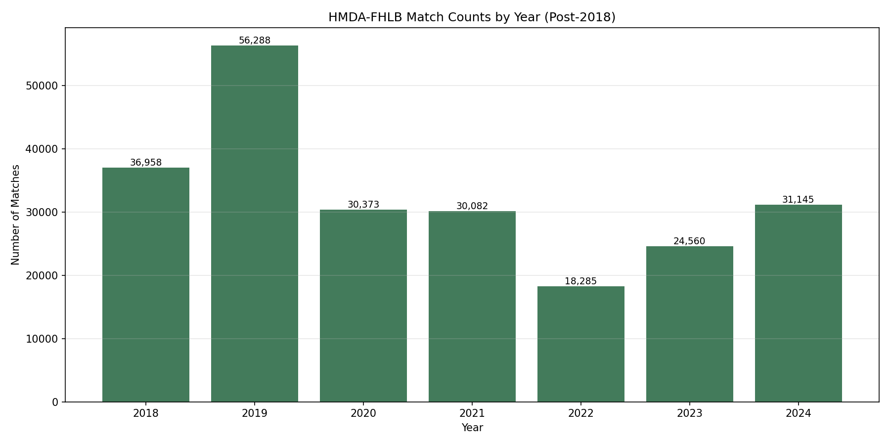
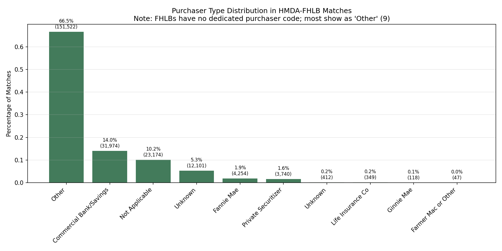
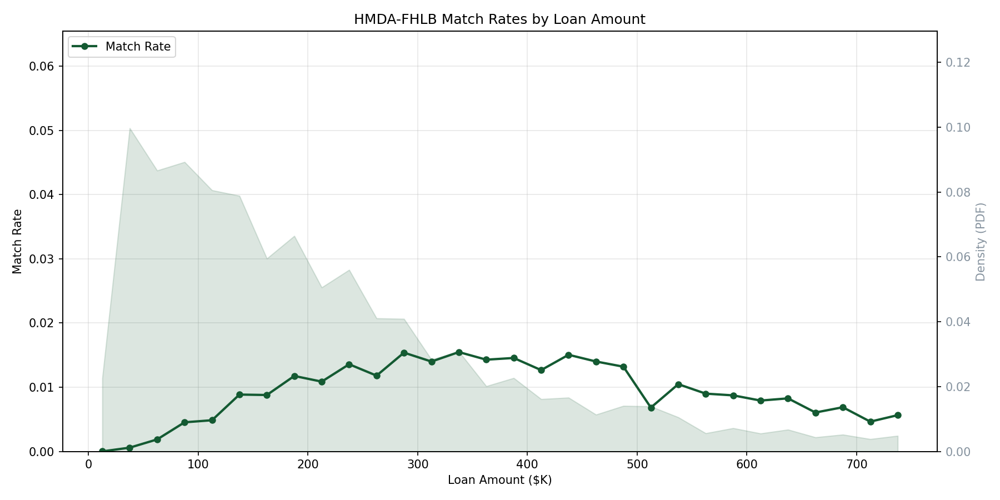

# HMDA-FHLB Matching Report

## Overview

This document describes the HMDA-FHLB matching workflow, which links HMDA (Home Mortgage Disclosure Act) loan records to FHLB (Federal Home Loan Bank) AMA (Acquired Member Assets) acquisition data.

The matching process identifies loans originated by FHLB member institutions that were subsequently sold or pledged to Federal Home Loan Banks through their MPF (Mortgage Partnership Finance), MAP, or MPP programs. Round 3 extends matching to non-member correspondent originators whose loans reach FHLBs through intermediary member banks.

The workflow supports both:
- **Post-2018 matching**: Uses LEI-based lender identification and modern HMDA schema (3 rounds)
- **Pre-2018 matching**: Uses respondent_id + agency_code for lender identification

## Data Sources

- **HMDA Data**: Loan application register data (post-2018 uses LEI-based identification; pre-2018 uses respondent_id + agency_code)
- **FHLB AMA Data**: FHLB Acquired Member Assets disclosure data
- **Avery Lender Panel Files**: Philadelphia Fed's "Avery File" to identify FHLB member institutions (post-2018 uses LEI-based, pre-2018 uses respondent_id + agency_code)
- **FHLB Quarterly Member Files**: Used to supplement Avery panel membership gaps (see [FHLB Membership Supplement](#fhlb-membership-supplement))
- **NCUA Call Report Data**: FS220B file type, `ACCT_896` field ("Member of the Federal Home Loan Bank") — used to identify FHLB-member credit unions missing from the Avery panel

## Methodology

### Post-2018 Matching

#### FHLB Membership Identification

FHLB member institutions are identified from the Avery lender panel (FHLB flag), supplemented by FHLB quarterly member files to close coverage gaps (see [FHLB Membership Supplement](#fhlb-membership-supplement) below). Rounds 1 and 2 restrict HMDA candidates to identified FHLB members; Round 3 matches against all HMDA originations.

#### Round 1 (Strict — FHLB Members Only)

Match keys:
- State
- Census tract
- Loan amount (exact)
- Loan type
- Loan term
- Interest rate (±0.0625%)
- LTV (±1.05%)
- DTI (±1%)
- Income (±$2,500)

#### Round 2 (Relaxed — FHLB Members Only)

Expanded tolerances for unmatched loans:
- Loan amount (±$15,000)
- Income (±$5,000)
- LTV (±2.05%)
- DTI (±2%)

#### Round 3 (Open — All HMDA Originations)

Matches remaining unmatched FHLB AMA loans against **all** HMDA originations (not just FHLB members), using the same join keys and tolerances as Round 1. This captures:

1. **Correspondent originator chains**: Non-member lenders originate loans, sell to FHLB member intermediaries, who then pledge to FHLB via AMA. The chain is: non-member originator → FHLB member bank → FHLB AMA.
2. **Residual Avery gap institutions**: Any FHLB members still not identified by the membership supplement.

Among Round 3 matches traceable through the HMDA seller/purchaser crosswalk, 99.8% were purchased by an FHLB member, and 87.9% have the purchaser reporting `purchaser_type=9` — providing strong validation of the correspondent chain hypothesis.

### Pre-2018 Matching

Uses respondent_id + agency_code for lender identification with:
- Income tolerance: ±$5,000
- **Flexible purpose mapping**: FHLB type 2 (refinance) matches both HMDA type 2 (refinance) and type 3 (home improvement)
  - Rationale: Pre-2018 FHLB data does not distinguish home improvement loans, classifying them as refinances
  - Many home improvement loans are structured as cash-out refinances
- Excludes loans sold to Fannie Mae (purchaser_type=1), Ginnie Mae (2), or Freddie Mac (3)
- Unique identification: Uses (activity_year, LoanCharacteristicsID) composite key for deduplication

### Deduplication

All rounds keep only 1:1 matches (each HMDA loan matches exactly one FHLB loan and vice versa).

### Default Matching Thresholds

| Parameter | Round 1 | Round 2 | Round 3 | Pre-2018 |
|-----------|---------|---------|---------|----------|
| HMDA pool | FHLB members | FHLB members | All originations | FHLB members |
| Income tolerance | $2,500 | $5,000 | $2,500 | $5,000 |
| LTV tolerance | 1.05% | 2.05% | 1.05% | — |
| DTI tolerance | 1% | 2% | 1% | — |
| Rate tolerance | 0.0625% | 0.0625% | 0.0625% | — |
| Term tolerance | 12 months | 12 months | 12 months | — |
| Amount tolerance | exact | $15,000 | exact | — |

## FHLB Membership Supplement

The Avery lender panel's FHLB flag has known coverage gaps — approximately 240 institutions that appear in FHLB quarterly member files but lack the FHLB flag in Avery. These gaps disproportionately affect credit unions with truncated or abbreviated names.

The supplement uses a three-strategy approach applied per year:

1. **NCUA Call Report (credit unions)**: The NCUA FS220B file's `ACCT_896` field provides an authoritative binary FHLB membership flag for all credit unions. Avery's `NCUA` column maps directly to NCUA `CU_NUMBER` (1,851 of 1,853 IDs overlap). This catches CUs with heavily abbreviated names (e.g., "KH CU", "AMERICAN SOUTHWEST CU") that are unreachable by name matching. NCUA provides membership status but not FHLB district; district is resolved via prefix matching against FHLB member files where possible, with `FHFBID=0` as a fallback (which passes through the matching filter).

2. **RSSD match (banks)**: Join on Federal Reserve ID between Avery and FHLB member files. In practice, all RSSD-matchable institutions already have the FHLB flag, so this yields no new members.

3. **Prefix-of name matching**: Check if either the Avery name or FHLB member name is a prefix of the other (case-insensitive). Two passes:
   - Names ≥ 8 characters: match without state validation (low ambiguity)
   - Names 3–7 characters: match **with** state validation (Avery FIPS → FHLB abbreviation) **and** uniqueness constraint (exactly one FHLB member in-state must match, to avoid false positives from generic names like "BLUE" or "VALLEY")

This supplement adds ~171 unique LEIs (~660 LEI-year rows) to the membership crosswalk, shifting ~5,700 loans from Round 3 into Rounds 1/2 where they are correctly classified as direct FHLB member matches. The NCUA strategy contributes ~12 LEIs that are unreachable by name matching alone. If NCUA data is unavailable, the supplement gracefully falls back to strategies 2-3 with a warning.

## Output

| Column | Type | Description |
|--------|------|-------------|
| HMDAIndex | String | HMDA loan identifier |
| LoanCharacteristicsID | Int64 | FHLB AMA loan identifier |
| MatchRound | UInt8 | 1=strict, 2=relaxed, 3=open |

## Key Findings

### FHLB Member Coverage

FHLB members originate approximately 35-55% of all HMDA loans (action_taken=1) depending on the year.

### Match Rates

**Post-2018 (2018-2024)**:

| Round | Description | Matches | Share of AMA |
|-------|------------|--------:|------------:|
| R1 | Strict (FHLB members) | 211,500 | 50.8% |
| R2 | Relaxed (FHLB members) | 3,603 | 0.9% |
| R3 | Open (all HMDA) | 12,542 | 3.0% |
| **Total** | | **227,645** | **54.6%** |

- 416,738 unique FHLB AMA loan IDs → 227,645 matches (54.6% overall)
- Stable performance across all years (2018-2024)

**Pre-2018 (2009-2017)**: Achieves 83.6% match rate overall
- 441,367 FHLB acquisitions → 264,431 matches
- Match counts range 21,000–40,000 per year across the full period

### Purchaser Type Distribution

Among post-2018 matched HMDA loans:
- 66.5% have purchaser_type=9 (Other) — consistent with FHLB sales having no dedicated code
- 14.0% have purchaser_type=6 (Commercial Banks/Savings Associations)
- 10.2% have purchaser_type=0 (Not Applicable)
- 5.3% have purchaser_type=71 (Credit Union/Savings/Thrift)

The higher pt=6 and pt=71 shares compared to prior versions reflect Round 3's inclusion of correspondent originators who code their FHLB-bound sales as going to the intermediary bank or credit union rather than to "Other."

### Income Variable Scaling

The FHLB TotalMonthlyIncomeAmount field appears to be effectively **annual income** in most cases. Comparing it directly to HMDA income (annual) yields high-quality matches, whereas treating it as monthly leads to large discrepancies.

## Likely-PFI Analysis

The workflow identifies Participating Financial Institutions (PFIs)—lenders who sell loans to FHLBs.

**Definition**: A lender (LEI) with at least one confirmed match to an FHLB acquisition record in a given year.

**Sample Statistics** (post-2018):

| Year | Total Matches |
|------|---------------|
| 2018 | 36,957 |
| 2019 | 56,288 |
| 2020 | 30,373 |
| 2021 | 30,082 |
| 2022 | 18,285 |
| 2023 | 24,555 |
| 2024 | 31,104 |

**Usage**: Filter lenders by threshold (e.g., fraction > 10% or total matches > 50) to classify lenders as PFIs.

## Issues and Limitations

1. **FHLB Purchaser Code**: FHLBs do not have a dedicated HMDA purchaser code, making validation indirect

2. **Income Scaling**: TotalMonthlyIncomeAmount appears mislabeled; treated as annual in matching

3. **Matching Ceiling**: After all three rounds, ~189,000 AMA loans (45.4%) remain unmatched. Of these, 85.7% have blocking candidates in HMDA but fail tolerance filters — the bottleneck is data quality differences (income, LTV, rate discrepancies between FHLB and HMDA reporting), not missing join keys. Only 2.6% have zero candidates even at the R2 blocking level.

4. **Freddie Mac Exclusion**: Records with purchaser_type=3 are excluded in Rounds 1-2 (FHLBs generally don't share programs with FHLMC)

5. **Avery Membership Gaps**: Despite the FHLB membership supplement, some institutions with very short or ambiguous names (e.g., "BLUE" in WY matching an insurance company instead of a credit union) cannot be reliably identified. These are caught by Round 3 instead.

## Validation

### Temporal Analysis

#### Full Timeline (2009-2024)



The combined timeline shows:
- **Pre-2018 (2009-2017)**: Stable matching at 21,000–40,000 matches per year
- **Post-2018 (2018-2024)**: Stable matching performance
  - Annual match volumes: 18,000-56,000 matches
  - Peak activity during 2019 refinancing wave
  - Consistency indicates robust methodology

### Purchaser Type Distribution



The purchaser type distribution in matched HMDA-FHLB records confirms expected patterns:

- **Purchaser Type 9 ("Other")**: ~67% of post-2018 matches — the expected dominant category because FHLBs have no dedicated HMDA purchaser code
- **Purchaser Type 6 (Commercial Banks/Savings)**: ~14% of matches
- **Purchaser Type 0 (Not Applicable)**: ~10% of matches

The dominance of purchaser_type=9 provides indirect validation that the matching methodology correctly identifies FHLB acquisitions. The non-trivial pt=6 and pt=71 shares are expected given Round 3's correspondent originator matches, where lenders code the sale to the intermediary bank rather than to "Other."

### Loan Characteristic Analysis

#### Match Rates by Loan Amount



Match rates are relatively stable across the loan amount distribution for both periods:
- **Pre-2018**: Match rates range from 40-70% across loan sizes, with higher rates reflecting the simpler matching criteria
- **Post-2018**: Match rates hover around 35-55% across most loan size categories
- The shaded region shows the density of FHLB loans by amount
- Slight variation at the tails reflects smaller sample sizes for very small or very large loans

The stability across loan sizes indicates no systematic bias toward particular loan amounts in either period.

### Borrower Age Concordance

Borrower age is not used in matching and therefore serves as an independent validation variable. HMDA reports `applicant_age` in 10-year bins (1=<25, 2=25-34, ..., 7=75+), while FHLB reports `Borrower1AgeAtApplicationYears` as exact integer age. Mapping FHLB ages into HMDA bins on the 223,813 matched pairs with valid age on both sides:

| HMDA Age Bin | N | Exact Match | Within ±1 Bin |
|-------------|------:|------:|------:|
| <25 | 7,081 | 95.9% | 99.8% |
| 25-34 | 57,327 | 98.7% | 99.9% |
| 35-44 | 61,821 | 99.1% | 100.0% |
| 45-54 | 45,096 | 99.0% | 99.9% |
| 55-64 | 32,323 | 99.1% | 99.9% |
| 65-74 | 15,991 | 99.3% | 99.9% |
| 75+ | 4,174 | 99.7% | 99.9% |
| **Overall** | **223,813** | **98.9%** | **99.9%** |

The near-perfect diagonal alignment (98.9% exact bin match) provides strong independent confirmation of match quality. The slight reduction in the <25 bin (95.9%) reflects boundary effects at the open-ended bin edge. The ~1% off-diagonal cases are almost exclusively ±1 bin, consistent with age rounding or minor timing differences between HMDA and FHLB reporting.

**By matching round:**

| Round | N | Exact Match | Within ±1 Bin |
|-------|------:|------:|------:|
| R1 (Strict) | 208,395 | 98.9% | 99.9% |
| R2 (Relaxed) | 3,576 | 96.4% | 98.9% |
| R3 (Open) | 11,842 | 98.9% | 99.9% |

Round 3 achieves 98.9% exact age concordance — essentially identical to Round 1 — confirming that the open matching against non-member correspondent originators produces high-quality matches. Round 2's slightly lower rate (96.4%) is expected given its relaxed tolerances.

### Summary

The HMDA-FHLB matching validation demonstrates that the workflow produces a meaningful crosswalk:

1. **Match rate of 54.6%**: Rounds 1-2 (FHLB members) contribute 51.6%, Round 3 (open/correspondent) adds 3.0%. The remaining 45.4% are unmatched due to tolerance filter failures, not missing join keys.

2. **Temporal consistency**:
   - Post-2018: Stable match volumes across years
   - Pre-2018: Stable match volumes across years

3. **Purchaser type validation**: ~67% of matches have purchaser_type=9 ("Other"), consistent with FHLBs lacking a dedicated HMDA code. The ~14% with pt=6 reflects correspondent originators coding sales to intermediary banks.

4. **Loan characteristics**: Match rates are stable across loan amount bins

5. **Age concordance**: 98.9% exact bin match across 223,813 pairs, with Round 3 (98.9%) matching Round 1 quality

6. **Key insight**: The primary value of this matching is identifying:
   - Which lenders (PFIs) actively sell loans to FHLBs
   - What types of loans FHLBs acquire
   - How FHLB acquisition patterns vary over time
   - The correspondent originator → FHLB member → FHLB AMA chain

**Interpretation note**: The 45.4% unmatched rate does NOT indicate poor methodology — 85.7% of unmatched loans have blocking candidates in HMDA but fail tolerance filters due to data quality differences between FHLB and HMDA reporting.

## Methodology Improvement: Pre-2018 Purpose Filter (March 2026)

An investigation revealed that the original pre-2018 match rate (25.9%) was artificially low due to incompatible purpose coding schemes between FHLB and HMDA:

### Root Cause

- **FHLB pre-2018**: No type 3 (home improvement) - lumps these loans into type 2 (refinance)
- **HMDA pre-2018**: Distinguishes type 2 (refinance) from type 3 (home improvement)
- **Old filter**: Required exact match, blocking 328,110 FHLB type 2 → HMDA type 3 candidates

### Solution

Updated the purpose filter to allow flexible mapping:

```python
# Exact match (1→1, 2→2) OR FHLB refinance → HMDA home improvement
purpose_filter = (
    (pl.col("Loan Purpose Type") == pl.col("loan_purpose")) |
    ((pl.col("Loan Purpose Type") == 2) & (pl.col("loan_purpose") == 3))
)
```

### Impact

| Metric | Before | After | Change |
|--------|--------|-------|--------|
| Total matches | 114,420 | 259,540 | +145,120 |
| FHLB match rate | 25.9% | 58.8% | +32.9pp |

**Purpose distribution in final matches:**
- FHLB 2 → HMDA 3 (new): 146,041 (56.3%)
- FHLB 1 → HMDA 1: 104,726 (40.4%)
- FHLB 2 → HMDA 2: 8,773 (3.4%)

**Match quality validation (passed all checks):**
- Income median difference: $232 (threshold: <$2,000)
- Income outliers >$5K: 0.0% (threshold: <20%)
- Gender alignment: 97.9% (threshold: >85%)

The flexible purpose mapping significantly improved pre-2018 match rates while maintaining high match quality.

## Methodology Improvement: Open Matching and Membership Supplement (March 2026)

An investigation into unmatched FHLB AMA loans revealed two structural issues:

### 1. Avery Panel FHLB Membership Gaps

240 institutions confirmed in FHLB quarterly member files lacked the FHLB flag in the Avery panel. Major institutions affected include Discover Bank, ServisFirst Bank, Ent Credit Union, and Rogue Credit Union. The FHLB membership supplement (described above) was added to address this gap.

### 2. Correspondent Originator Chain

Many FHLB AMA loans originate from non-member lenders who sell through FHLB member intermediaries. Tracing through the HMDA seller/purchaser crosswalk confirmed: 99.8% of traceable non-member matches were purchased by an FHLB member, with 87.9% of purchasers reporting `purchaser_type=9`. Round 3 was added to capture these correspondent matches.

### Impact

| Change | Effect |
|--------|--------|
| FHLB membership supplement (NCUA + RSSD + prefix) | +5,759 loans correctly classified in R1/R2 (shifted from R3) |
| Round 3 (open matching) | +12,542 new matches from non-member/correspondent originators |
| **Net new matches** | **+13,124** (from 214,521 to 227,645) |
| **Match rate** | 51.5% → 54.6% (+3.1pp) |

See `investigations/reports/investigation_fhlb_ama_open_matching_2026-03-07.md` for the full analysis.
