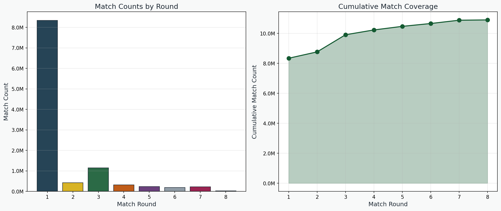
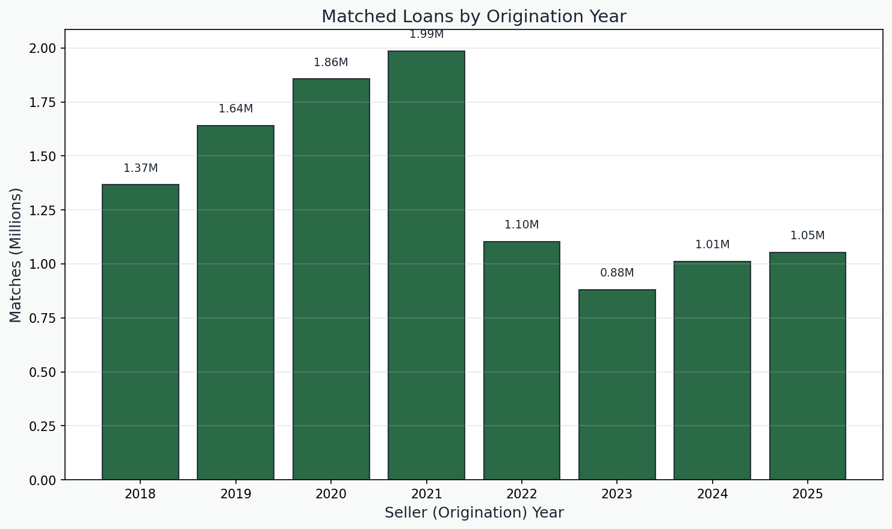
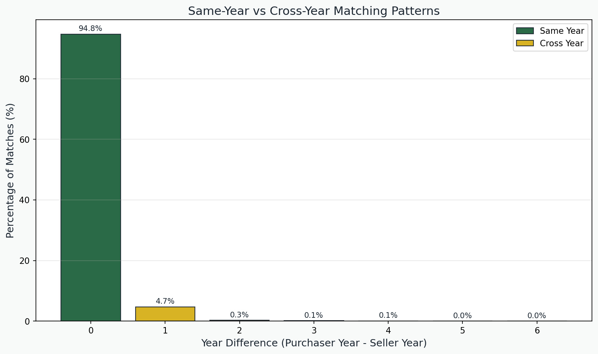
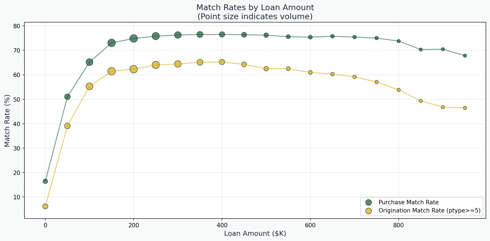
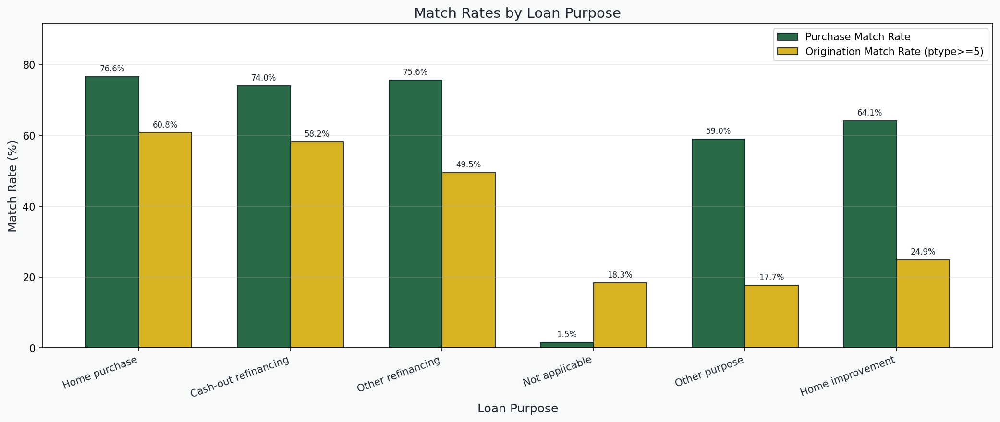
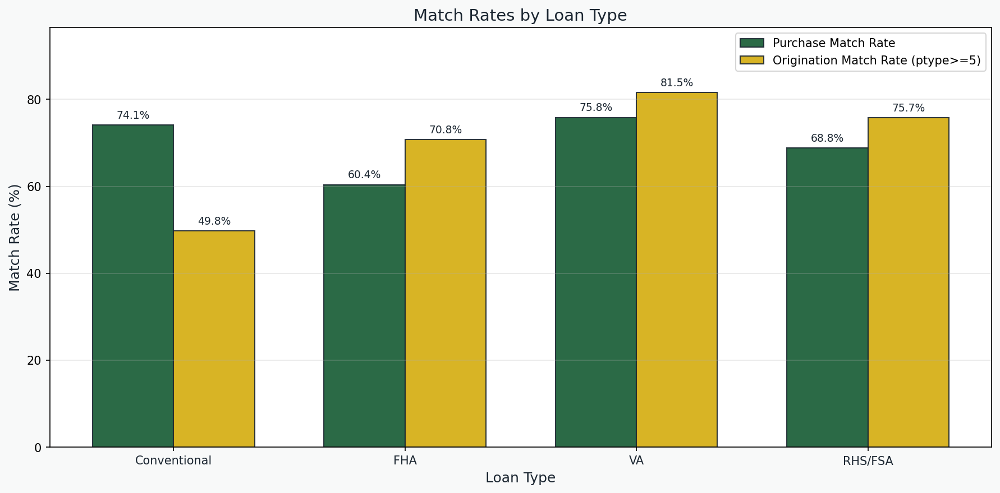
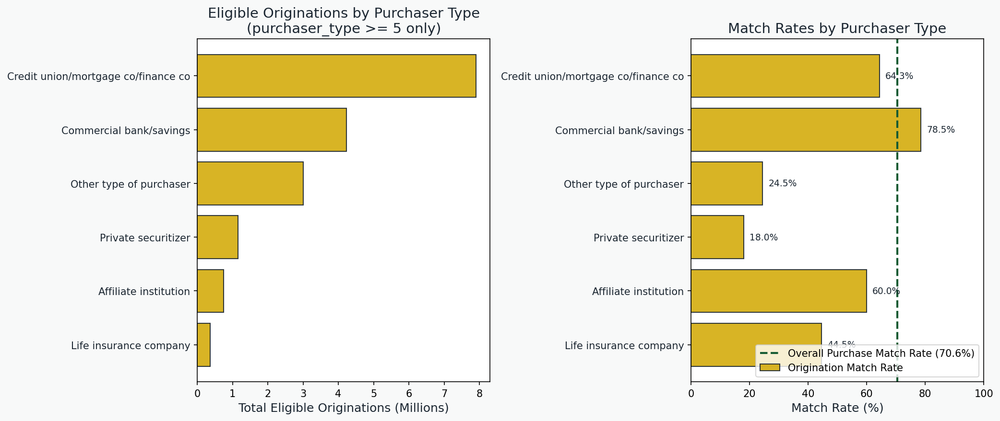

# HMDA Sellers-Purchasers Matching Report

## Overview

This document describes the HMDA seller-purchaser matching workflow, which links loan originations (sellers) with loan purchases (purchasers) within HMDA data to track secondary market activity.

When a lender originates a loan and later sells it, both the origination and purchase appear as separate records in HMDA. This workflow links those records to track loan sales, enabling analysis of secondary market patterns, loan disposition timing, and the relationship between originating lenders and purchasers.

The workflow uses a multi-round approach with progressively relaxed matching criteria. Early rounds capture high-confidence matches with strict tolerances, while later rounds use looser criteria to capture remaining matches.

## Data Sources

- **HMDA Data**: Post-2018 HMDA loan application register, with records separated into:
  - **Sellers (Originations)**: Records with action_taken = 1 (loan originated)
  - **Purchasers**: Records with action_taken = 6 (loan purchased)

Key fields used:
- HMDAIndex: Unique loan identifier
- lei: Legal Entity Identifier (lender)
- loan_type, loan_amount, census_tract: Match keys
- income, interest_rate, loan_term: Tolerance fields
- Various fee columns for fee matching
- Demographic fields (age, sex, race, ethnicity)

### Purchaser-Side Field Availability

Purchaser records (action_taken = 6) carry far fewer usable attributes than originations, which
constrains the set of viable match keys. A column-informativeness audit of the purchaser side found
that the underwriting and risk fields are systematically empty or sentinel-filled — so they offer no
discriminatory power and are deliberately excluded from matching:

| Field group | State on purchaser records |
|-------------|----------------------------|
| `combined_loan_to_value_ratio`, `debt_to_income_ratio`, `rate_spread`, `prepayment_penalty_term` | ~99.5% `-99999` (Not Applicable) — effectively single-valued |
| `applicant_credit_score_type`, `co_applicant_credit_score_type`, `aus_1`, `denial_reason_1`, `submission_of_application`, `initially_payable_to_institution` | One real code plus `1111` (Exempt); no usable spread |
| `aus_2`–`aus_5`, `denial_reason_2`–`denial_reason_4` | 100% null |
| `preapproval` | Single value (`2`, not requested) |

Consequently the rounds key on the structural loan-level fields that *are* populated on both sides
(loan_type, loan_amount, census_tract, occupancy_type, loan_purpose) plus fee columns and
demographics, rather than on underwriting attributes. Using the empty/sentinel fields as keys would
only inject false negatives and noise. (Sentinels `1111`/`-99999` are still replaced with null during
data preparation regardless.)

## Methodology

### Configuration-Driven Design

The matching engine uses a declarative configuration system where each round is defined by match columns, tolerances, fee strategy, uniqueness constraints, and workflow flags that control operation ordering.

### Workflow Steps

Each round executes a multi-step workflow including:

1. Load unmatched data (exclude already-matched records from prior rounds)
2. Apply data filters (purchaser type, action taken, etc.)
3. Prepare data (replace missing values, handle zeros)
4. Get match columns and drop nulls
5. Split sellers/purchasers and join on match columns
6. Apply year constraint (seller year <= purchaser year for cross-year)
7. Ensure refinance type consistency
8. Apply numeric tolerances
9. Match on demographic fields (age, sex, race, ethnicity)
10. Calculate and apply fee match filters
11. Apply quality filters and best-match selection
12. Enforce uniqueness constraints (one-to-one or one-to-many)
13. Apply post-unique tolerances and filters
14. Save crosswalk

### Workflow Variants

Two workflow orderings are controlled by configuration flags:

**Early Rounds (1, 2, 5)**:
- Demographics checked after uniqueness
- Weak tolerances applied before fee matching
- Standard tolerance function for post-tolerances

**Standard Rounds (3, 4, 6, 7, 8)**:
- Demographics checked before fee matching
- Weak tolerances applied after fee matching
- Specialized post-unique tolerance function

## Round Configurations

### Round 1: Same-Year Exact Matches

**Purpose**: Capture highest-confidence matches within the same year.

| Parameter | Value |
|-----------|-------|
| Match columns | loan_type, loan_amount, census_tract, occupancy_type, loan_purpose, activity_year |
| Year constraint | Same year only |
| Tolerances | income ≤ 1, interest_rate ≤ 0.0625 |
| Fee strategy | Strict (at least one exact fee match) |
| Uniqueness | One-to-one |
| Demographics | Yes (after uniques) |

**Post-tolerances**: Extensive checks on conforming_loan_limit, construction_method, discount_points, intro_rate_period, lender_credits, lien_status, loan_term, open_end_line_of_credit, origination_charges, property_value, total_units, applicant ages.

**Expected matches**: ~7.5M

### Round 2: Cross-Year Strict Matches

**Purpose**: Match loans sold in a different year than originated.

| Parameter | Value |
|-----------|-------|
| Match columns | loan_type, loan_amount, census_tract, occupancy_type, loan_purpose |
| Year constraint | Cross-year (seller_year ≤ purchaser_year) |
| Tolerances | income ≤ 1, interest_rate ≤ 0.0625 |
| Fee strategy | Strict |
| Uniqueness | One-to-one |
| Demographics | Yes (after uniques) |

**Expected matches**: ~368K

### Round 3: Secondary Sales (One-to-Many)

**Purpose**: Capture secondary sales where one origination may have multiple purchase records.

| Parameter | Value |
|-----------|-------|
| Match columns | loan_type, loan_amount, census_tract, occupancy_type, loan_purpose |
| Year constraint | Cross-year |
| Tolerances | income ≤ 1, interest_rate ≤ 0.0625, plus structural fields |
| Fee strategy | Generous (any fee column matches any other) |
| Uniqueness | One-to-many |
| Demographics | Yes (before fees) |

**Expected matches**: ~1.02M

### Round 4: Without Loan Purpose Match

**Purpose**: Match loans where loan purpose may differ, using purchase indicator instead.

| Parameter | Value |
|-----------|-------|
| Match columns | loan_type, loan_amount, census_tract, occupancy_type, i_Purchase |
| Year constraint | Cross-year |
| Fee strategy | Generous |
| Uniqueness | One-to-many |
| Filter refi types | Yes |

**Expected matches**: ~267K

### Round 5: Loan Amount Tolerance

**Purpose**: Match loans with slight loan amount differences (rounding, fees).

| Parameter | Value |
|-----------|-------|
| Match columns | loan_type, census_tract, occupancy_type, i_Purchase, activity_year |
| Year constraint | Same year |
| Tolerances | loan_amount ≤ 10000, income ≤ 1, interest_rate ≤ 0.0625 |
| Fee strategy | Strict |
| Uniqueness | One-to-one |
| Additional filters | loan_amount_s ≥ loan_amount_p, purchaser_type_p in [0,1,2,3,4] |

**Expected matches**: ~211K

### Round 6: Exclude Portfolio/NA

**Purpose**: Match non-portfolio loans with looser tolerances.

| Parameter | Value |
|-----------|-------|
| Data filter | Exclude purchaser_type 0 (portfolio) and 9 (N/A) |
| Match columns | loan_type, loan_amount, census_tract, occupancy_type, i_Purchase |
| Year constraint | Cross-year |
| Fee strategy | Generous |
| Uniqueness | One-to-many |
| Filter refi types | Yes |

**Expected matches**: ~165K

### Round 7: Minimal Filters with Fee Requirement

**Purpose**: Capture remaining matches with minimal filters but requiring fee consistency.

| Parameter | Value |
|-----------|-------|
| Data filter | Exclude purchaser_type 0 and 9 |
| Match columns | loan_type, loan_amount, census_tract, occupancy_type, i_Purchase |
| Tolerances | interest_rate ≤ 0.0625, total_units = 0 |
| Fee strategy | None (deferred) |
| Uniqueness | One-to-one |
| Demographics | No |
| Post-unique filter | NumberFeeMatches ≥ 1 |

**Expected matches**: ~209K

### Round 8: Purchaser-Type Constrained

**Purpose**: Use prior-round relationships to constrain matching.

| Parameter | Value |
|-----------|-------|
| Match columns | loan_type, loan_amount, census_tract, occupancy_type, i_Purchase |
| Year constraint | Cross-year |
| Fee strategy | Generous |
| Uniqueness | One-to-many |
| Quality filters | Yes |
| Special constraint | Use purchaser types from Round 7 |

**Expected matches**: ~19K

## Matching Functions

### Tolerance Matching

**Numeric tolerances**: Filters records where the absolute difference between seller and purchaser values is within tolerance. Applied to income, interest_rate, loan_amount.

**Weak numeric tolerances**: Keeps only the best match per loan based on minimum difference. Used to select highest-quality matches when multiple candidates exist.

### Fee Matching

Fee matching compares fee columns (discount_points, lender_credits, origination_charges, total_loan_costs, total_points_and_fees) between seller and purchaser.

**Strict fee matching**: Requires at least one fee column to match exactly.

**Generous fee matching**: Allows any fee column to match any other fee column.

### Demographics Matching

Applies four demographic filters:
- Age consistency (applicant and co-applicant)
- Sex consistency
- Race consistency
- Ethnicity consistency

### Uniqueness

- **One-to-one**: Each seller matches exactly one purchaser and vice versa
- **One-to-many**: Each purchaser matches exactly one seller, but sellers can have multiple purchasers (secondary sales)

## Output

| Column | Type | Description |
|--------|------|-------------|
| HMDAIndex_s | String | Seller (origination) loan identifier |
| HMDAIndex_p | String | Purchaser loan identifier |
| lei_s | String | Seller LEI |
| lei_p | String | Purchaser LEI |
| activity_year_s | Int32 | Origination year |
| activity_year_p | Int32 | Purchase year |

Output is partitioned by activity_year_s and match round.

## Results

### Match Statistics (2018-2024)

| Round | Description | Matches |
|-------|-------------|---------|
| 1 | Same-year exact | 8,344,008 |
| 2 | Cross-year strict | 423,828 |
| 3 | Secondary sales | 1,143,680 |
| 4 | Without loan purpose | 321,849 |
| 5 | Loan amount tolerance | 239,772 |
| 6 | Exclude portfolio/NA | 189,708 |
| 7 | Minimal + fee requirement | 220,321 |
| 8 | Purchaser-type constrained | 20,165 |
| **Total** | | **10,903,331** |

## Issues and Limitations

### Sequential Round Execution

Rounds must execute in order because:
1. Each round excludes already-matched records from prior rounds
2. Round 8 uses purchaser-type relationships discovered in Round 7

### Key Design Decisions

1. **Early vs Standard workflow**: Early rounds (1, 2, 5) apply demographics after uniqueness to maximize initial match quality. Standard rounds apply demographics earlier to reduce candidate set before expensive operations.

2. **Fee matching strategies**: Strict requires exact fee matches for high confidence. Generous allows cross-column matches for greater coverage.

3. **One-to-one vs one-to-many**: One-to-one for primary sales, one-to-many for secondary market activity where loans may be resold.

4. **Incremental matching**: Each round builds on prior rounds, capturing progressively harder-to-match records with appropriate confidence levels.

## Validation

### Round-by-Round Analysis

The round-by-round breakdown shows the contribution of each matching round to the overall crosswalk:

- **Round 1** (same-year exact matches) captures the vast majority (~77%) of all matches
- **Round 3** (secondary sales, one-to-many) is the second-largest contributor (~10.5%)
- **Rounds 2, 4-8** capture progressively harder-to-match records with more relaxed criteria

This distribution is expected: most loan sales occur within the same year with exact attribute matches, while cross-year sales and secondary market activity require looser matching tolerances.

### Temporal Analysis

#### Matches by Year

The temporal analysis shows stable matching patterns across the sample period (2018-2025). Annual match volumes reflect the overall loan origination and secondary market activity in each year. The COVID-era refinancing boom (2020-2021) shows elevated activity.

#### Cross-Year Patterns

The cross-year heatmap shows the distribution of matched pairs by seller year (origination) and purchaser year (purchase). Key observations:

- **Diagonal dominance**: Most matches occur in the same year (diagonal line)
- **Above-diagonal clustering**: Cross-year matches show sales typically occur within 1-2 years of origination
- **No below-diagonal entries**: Loans cannot be purchased before origination (enforced by year constraint)

### Loan Characteristic Analysis

#### Match Rates by Loan Amount

Match rates are relatively stable across the loan amount distribution. The slight variation at higher loan amounts reflects the smaller sample size for jumbo loans in the secondary market.

#### Match Rates by Loan Purpose

Match rates by loan purpose show expected patterns:
- **Purchase loans**: Higher match rates as these are frequently securitized
- **Refinances**: Slightly lower match rates; some refinances are held in portfolio
- **Other purposes**: Lower match rates reflecting more heterogeneous disposition

#### Match Rates by Loan Type

Conventional and government-backed loans (FHA, VA) show high match rates, reflecting active secondary market participation. Other loan types show more variable rates.

#### Match Rates by Purchaser Type

The purchaser type distribution in matched records shows expected patterns:
- **GSEs (1, 3)**: Fannie Mae and Freddie Mac are dominant purchasers
- **Ginnie Mae (2)**: Significant share from FHA/VA securitization
- **Other (9)**: Includes FHLBs and other secondary market participants
- **Portfolio (0)**: Lower match rates as some portfolio holdings don't appear as purchases

### Summary

The validation analyses confirm that the HMDA sellers-purchasers matching produces a high-quality crosswalk:

1. **Round hierarchy**: Round 1 (same-year exact) captures 77% of matches; later rounds add progressively harder cases
2. **Temporal consistency**: Match volumes are stable across years, reflecting secondary market activity
3. **Cross-year patterns**: Sales typically occur within 1-2 years of origination
4. **Loan characteristics**: Match rates are stable across:
   - Loan amount distribution
   - Loan purpose (purchase vs refinance)
   - Loan type (conventional vs government)
5. **Purchaser distribution**: GSEs (Fannie, Freddie, Ginnie) dominate as expected

**Total match count**: 10.9 million matched seller-purchaser pairs (2018-2025), with origination-side match rate 57.2% (purchaser_type≥5) and purchase-side match rate 70.6%
