# MBS-FHFA Matching Report

## Overview

This document describes matching workflows that link MBS (Mortgage-Backed Securities) loan-level disclosure data from the GSEs (Fannie Mae and Freddie Mac) to FHFA (Federal Housing Finance Agency) single-family census tract data.

The matching enables researchers to combine MBS performance data (credit scores, servicer information) with FHFA demographic and geographic data (borrower race, ethnicity, income, census tract).

| Workflow | MBS Source | Match Rate (2019-2024) | Notes |
|----------|------------|------------------------|-------|
| **FNMA-FHFA** | Fannie Mae issuances | 94.8% FNMA / 93.0% FHFA | 0.01% rate tolerance |
| **FHLMC-FHFA** | Freddie Mac originations | 93.9% FHLMC / 93.5% FHFA | MSA via Census crosswalk, term binning, uses CLTV |

## Data Sources

- **FHFA sf_c Data**: FHFA single-family census tract file containing ~2M loans/year for both Fannie (enterprise_flag=1) and Freddie (enterprise_flag=2), with binned values similar to HMDA
- **FNMA Issuances**: Fannie Mae loan-level disclosure for loans securitized in each quarter
- **FHLMC Originations**: Freddie Mac loan-level disclosure for loans originated in each quarter

**Important**: FHFA includes high-LTV loans (≥100% LTV from programs like HomeReady with MI) that are not present in MBS issuance data.

## Methodology

### Data Alignment: Securitization vs Acquisition Timing

A critical insight is that FHFA files represent loan **acquisitions** for a given year, while FNMA quarterly files represent loan **securitizations**. These are different events:

1. A loan originated in November 2023 may be acquired by Fannie Mae in December 2023 (appears in FHFA 2023)
2. That same loan may be securitized into an MBS pool in January 2024 (appears in FNMA 2024Q1)

**For matching FHFA year N, use FNMA year N files.** The FNMA year N files contain all loans securitized in year N, which includes:
- Loans originated and acquired in year N (the majority)
- Loans originated in year N-1 but securitized in early year N

This alignment works because loans are typically securitized within a few months of acquisition.

### Why FHFA Match Rates Are Lower Than FNMA Match Rates

The FHFA match rate (~93%) is slightly lower than the MBS match rate (~94%) due to structural differences:

1. **High-LTV loans**: FHFA includes loans with LTV ≥ 100% (from programs like HomeReady with MI) that are not present in FNMA MBS issuance data. FNMA issuance data caps at 97% LTV.

2. **Matching imperfections**: Some loans exist in both datasets but don't match due to minor field differences or tolerance thresholds.

### Year-Based Pre-Filtering

FHFA includes a date_of_mortgage_note field indicating whether the loan was originated in the same year as acquisition or a prior year:
- **1** = Originated in same calendar year as acquired (~92% of loans)
- **2** = Originated prior to calendar year of acquisition (~8% of loans)

Both FNMA and FHLMC matching use this to pre-filter candidates:
- FHFA loans with flag=1 match only to MBS loans originated in the acquisition year
- FHFA loans with flag=2 match only to MBS loans originated in the prior year

**FNMA**: Uses the explicit Origination Date field.

**FHLMC**: Extracts origination year from the Loan Sequence Number, which embeds the origination quarter (e.g., `F23Q10031582` = 2023 Q1).

### Exact Match Fields

**FNMA-FHFA:**
- State (FIPS code)
- MSA (Metropolitan Statistical Area)
- Channel (Retail/Broker/Correspondent)
- Number of units
- Number of borrowers
- First-time homebuyer status
- Loan purpose (purchase/refi/cash-out)
- Occupancy status (primary/second/investment)
- Property type (site-built/manufactured)
- Loan term (months)
- Loan amount (pre-rounded to FHFA $10k bins)

**FHLMC-FHFA:**
- Same fields as FNMA (MSA included after mapping FHLMC Metropolitan Division codes to parent CBSA codes via Census crosswalk)

### Interest Rate Matching

Interest rate is the most reliable matching field:
- **FNMA**: 0.01% tolerance (accounts for minor FHFA rounding differences in early years)
- **FHLMC**: 1 basis point tolerance (FHFA rounds Freddie rates to hundredths, e.g., 7.125% → 7.12%)

### Tolerance-Based Fields

| Field | FNMA | FHLMC | Reason |
|-------|------|-------|--------|
| Loan amount | Exact (pre-rounded) | Exact (pre-rounded) | Both pre-round to FHFA $10k bin midpoints before joining |
| LTV/CLTV | ±1% | ±1% | FHFA reports "CLTV where available"; FHLMC uses CLTV when available |
| DTI | Bin-aware | Bin-aware | Smart matching handles FHFA binning scheme |

### LTV vs CLTV Handling

FHFA's "LTV at origination" field (Field #42) actually reports "Combined LTV (CLTV) where available" per their data dictionary. This means when a loan has a subordinate lien, FHFA reports the combined total LTV including both liens.

To match properly, both workflows coalesce CLTV/LTV: using CLTV when available and falling back to LTV when CLTV is null. This ensures we're comparing apples to apples for loans with second liens.

### FHLMC Loan Amount Pre-Rounding

For FHLMC matching, loan amounts are pre-rounded to FHFA's $10k bin midpoints before joining:

- FHFA reports loan amounts as $10k bin midpoints (e.g., $175,000 represents loans from $170,000-$179,999)
- FHLMC amounts are rounded to the appropriate bin midpoint
- **Edge case**: Amounts exactly on $10k boundaries are duplicated to try both adjacent bins

This approach eliminates the need for amount tolerance in the join, improving precision.

### FHFA Data Binning

FHFA sf_c uses binned values:

| Field | Format | Example |
|-------|--------|---------|
| Loan Amount | $10k bins at midpoint | $205,000 = loans $200k-$209,999 |
| LTV | Integer percentage | 80 = 80% LTV |
| DTI | Binned for ranges, exact 36-49 | See below |

**DTI Binning** (per FHFA dictionary):
- 10 = Less than 20%
- 20 = 20 to less than 30%
- 30 = 30 to less than 36%
- 36-49 = Actual value (exact)
- 50 = 50 to 60%
- 60 = Greater than 60%
- 99 = Not available

### Duplicate Resolution

Both workflows use mutual best-match scoring with 1:1 unique matching enforcement.

## Output

The crosswalk files contain:

| Column | Type | Description |
|--------|------|-------------|
| fnma_loan_id / fhlmc_loan_id | String | MBS loan identifier (column name varies by enterprise) |
| fhfa_enterprise | Int | 1=Fannie Mae, 2=Freddie Mac |
| fhfa_record_id | Int | FHFA record identifier |
| fhfa_year | Int | FHFA data year |

## Results

### FNMA-FHFA Match Quality

The key quality indicators are interest rate and LTV matching:

- **~99.9% of matches have exact interest rate AND exact LTV**
- Interest rate is the most reliable field for confirming match quality
- LTV values match exactly in nearly all cases (both datasets use integer percentages)

Note: Loan amount is not a meaningful quality indicator because FHFA uses $10k bins (e.g., $205,000 represents loans from $200k-$209,999).

### FHLMC-FHFA Match Quality (2019-2024)

| Tier | Criteria | % of Matches |
|------|----------|--------------|
| 1 | Near-exact rate + exact amount + exact CLTV | ~3-5% |
| 2 | Near-exact rate + exact CLTV | ~30-86% |
| 3 | Near-exact rate only | ~42-69% |

**100% of matches have near-exact interest rate (within 1 basis point).**

The distribution varies by year—recent years (2023-2024) show more Tier 2 matches (~54-86%), while high-volume refi years (2020-2021) show more Tier 3 matches (~69%).

### FHLMC-FHFA Match Rates by Year

| Year | Total Matches | FHFA Records | FHFA Match Rate |
|------|---------------|-------------|-----------------|
| 2019 | 1,599,915 | 1,759,865 | 90.9% |
| 2020 | 3,517,347 | 3,779,972 | 93.1% |
| 2021 | 3,922,864 | 4,216,913 | 93.0% |
| 2022 | 1,748,023 | 1,800,763 | 97.1% |
| 2023 | 918,830 | 954,240 | 96.3% |
| 2024 | 990,430 | 1,028,135 | 96.3% |
| **Total** | **12,655,112** | **13,539,888** | **93.5%** |

*Note: 12,697,409 raw matched pairs reduced to 12,655,112 after deduplication by FHLMC loan ID (42,297 duplicate matches removed).*

**Why ~6% of loans don't match:**
1. **High-LTV products (~1.5%)**: FHFA includes Home Possible and other affordable products with LTV >97% that FHLMC excludes from public disclosure
2. **Non-disclosed loans (unknown %)**: Portfolio loans and special programs are not included in FHLMC public disclosure, but we cannot identify which FHFA records fall into this category
3. **Matching algorithm gaps (unknown %)**: Normal-LTV loans that should match but don't due to field differences

Note: We cannot separately quantify categories 2 and 3 because portfolio loans are not identifiable in the FHFA data.

## Data Quality Issues

### FHFA 2020: Loan Purpose Codes Swapped (FNMA) — Resolved Upstream 2026-04

**Status**: Resolved at the source. FHFA published a corrected 2020 Enterprise PUDB on 2026-04-09 as `2020_enterprise_pudb_corrected.zip` (data files inside `2020_PUDB_CORR/`). The previously distributed `2020_enterprise_pudb.zip` had codes 2 and 7 inverted for FNMA in the Single-Family Census Tract file.

**Original issue**: In the original 2020 file, loan purpose codes 2 (Refinance, no cash-out) and 7 (Cash-out Refinance) were swapped for Fannie Mae loans.

**Evidence (original file)**:
- FHFA 2020 reported 2.39M loans as "Cash-out (7)" and 978K as "Refi (2)"
- FNMA 2020 disclosure data reported 2.38M as "Refi (2)" and 975K as "Cash-out (7)"
- These numbers were nearly identical but inverted
- Adjacent years (2019, 2021) showed correct alignment between FHFA and FNMA

**Verification of the correction** (`fnma_sf2020c_loans.txt`, position 97):

| Code | Meaning | Original (2025-02) | Corrected (2026-04) |
|------|---------|---:|---:|
| 1 | Purchase | 1,482,310 | 1,482,310 |
| 2 | Refi (no cash-out) | 978,315 | 2,394,244 |
| 4 | Home Improvement | 2,756 | 2,756 |
| 7 | Cash-out Refi | 2,394,244 | 978,315 |

The figures below were generated from the original (pre-correction) file and are kept for historical context:

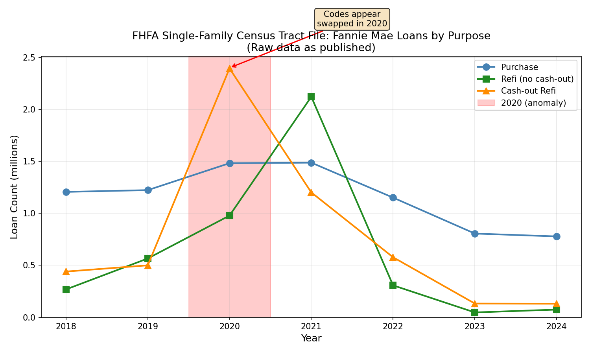
*Original FHFA 2020 file showed an anomalous spike in cash-out refis*

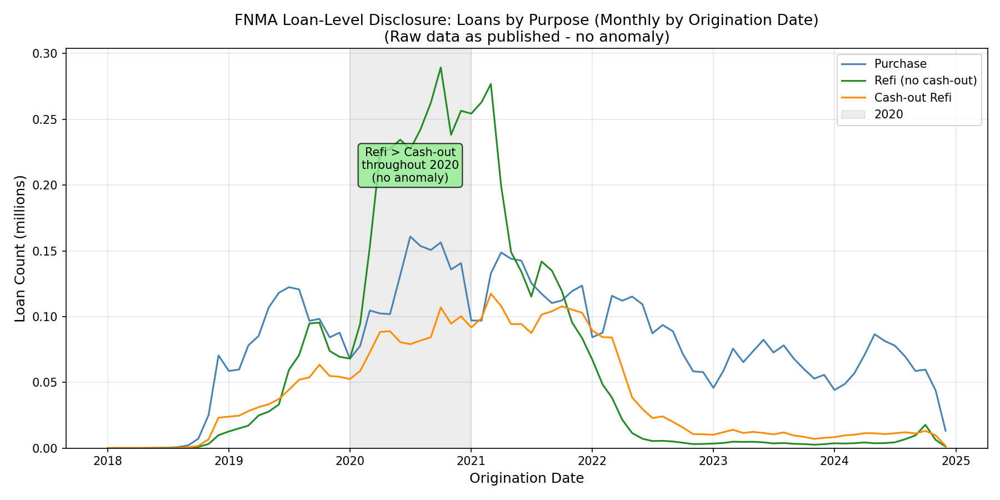
*FNMA monthly data showed no such anomaly—Refi > Cash-out throughout 2020*

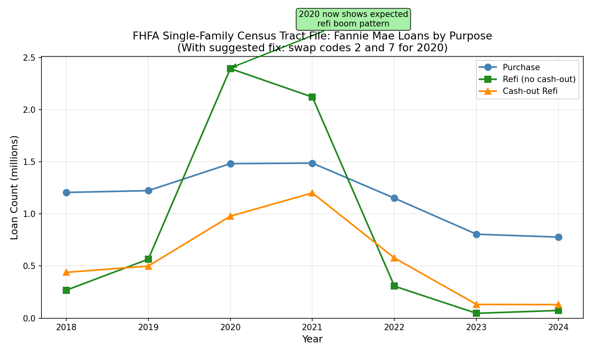
*With codes 2 and 7 swapped for 2020, the pattern was consistent — confirmed by FHFA's correction*

**Codebase change**: The 2↔7 swap previously applied in `fhfa/import_silver.py` was removed once FHFA released the corrected file. The bronze importer in `fhfa/import_bronze.py` now prefers a `*_corrected.zip` over the original when both are present in `data/fhfa/raw/`. **Anyone with bronze/silver derived from the original 2020 zip must rebuild from the corrected zip** — running silver against the new corrected bronze without rebuilding bronze will silently mix corrected and uncorrected records.

### FHLMC Metropolitan Division Mapping

**Issue**: FHLMC reports Metropolitan Division (MD) codes for 13 large metropolitan areas, while FHFA normalizes all geographic codes to the parent CBSA (Core Based Statistical Area) level. This caused systematic match failures when MSA was used as an exact join field without mapping.

**Root Cause**: The OMB defines Metropolitan Divisions as subdivisions of large CBSAs (e.g., the New York-Newark-Jersey City CBSA contains 4 Metropolitan Divisions). FHLMC reports at the MD level for these metros, while FHFA rolls them up to the parent CBSA. This is not an error by either party—they simply report at different levels of geographic granularity.

**Solution**: The Census Bureau's Core Based Statistical Area delineation file provides an authoritative MD-to-CBSA crosswalk. The matching workflow applies this crosswalk to map FHLMC's 40 Metropolitan Division codes (from both 2020 and 2023 OMB vintages) to their parent CBSA codes before joining.

**Result**: After applying the Census crosswalk, MSA codes agree between FHLMC and FHFA for 99.45% of matched records. MSA is now used as an exact join key for FHLMC-FHFA matching, improving match precision.

**Comparison to FNMA**: FNMA reports at the CBSA level (matching FHFA), so FNMA-FHFA matching has always used MSA as an exact join field without issues.

### FHLMC Loan Term Binning (Undocumented)

**Issue**: FHFA bins non-standard loan terms to the nearest standard value for Freddie Mac loans, but NOT for Fannie Mae loans. This behavior is not documented in the FHFA data dictionary.

**Discovery**: Investigating why FHLMC loans with non-standard terms (300, 348, 324 months, etc.) had 0% match rates, we found:

| Enterprise | Non-Standard Terms in MBS | Non-Standard Terms in FHFA | Impact |
|------------|---------------------------|---------------------------|--------|
| **Fannie Mae** | 4,658 (0.5% of 2023) | 4,677 (0.5%) | **Preserved** - terms match exactly |
| **Freddie Mac** | 3,937 (0.4% of 2023) | 0 (0.0%) | **Binned** - all mapped to standard |

**Empirical Evidence**: By examining FHLMC loans with non-standard terms that matched via relaxed matching (without term as an exact field), we discovered the binning pattern:

| FHLMC Term | Years | Example Count | FHFA Term | Confidence |
|------------|-------|---------------|-----------|------------|
| 300 | 25.0 | 1,077 | 360 (30yr) | 93% |
| 348 | 29.0 | 604 | 360 (30yr) | 92% |
| 324 | 27.0 | 257 | 360 (30yr) | 94% |
| 144 | 12.0 | 63 | 180 (15yr) | 56% |
| 96 | 8.0 | 139 | mixed (360/120/180) | varies |

**FHFA Standard Terms**: FHFA only reports 5 loan terms for Freddie Mac: 360, 180, 240, 120, and 480 months.

**Documentation Gap**: The FHFA data dictionary (Field #44: "Term of Mortgage at Origination") only states "999 = Not available, Months" and does not mention any term binning rules. This undocumented behavior affects ~2% of FHLMC loans.

**Solution Implemented**: The FHLMC matching code now pre-bins all non-standard terms to the nearest FHFA standard term before matching. This improved match rates by ~1.3 percentage points, gaining ~180,000 additional matches.

**Comparison to FNMA**: Fannie Mae loans with non-standard terms match at 95%+ because FHFA preserves their exact term values. This differential treatment between enterprises is undocumented, but the pre-binning solution aligns FHLMC matching with FHFA's actual behavior.

## Validation

### FNMA-FHFA Validation

#### Temporal Analysis

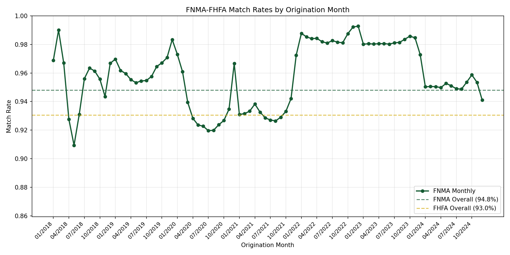

Match rates across 2019-2024 by origination month are highly stable, typically ranging between 88-92% from both FNMA and FHFA perspectives. The consistency month-to-month indicates no systematic timing bias.

#### Loan Amount

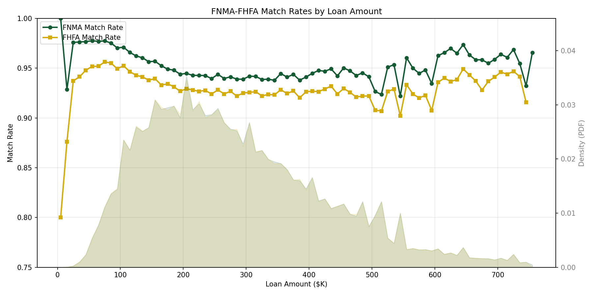

Match rates remain stable across the loan amount distribution, with no systematic bias toward small or large loans.

#### LTV

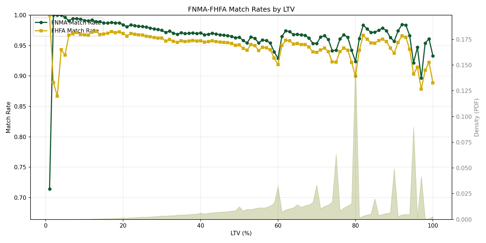

Match rates by 1% LTV intervals show strong consistency across the LTV spectrum. The density overlay shows concentration at common LTV values (80%, 95%, 97%).

#### Interest Rate

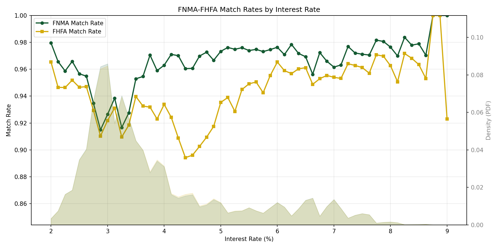

Match rates are stable across rate environments, spanning both low-rate (2020-2021) and high-rate (2022-2024) periods.

#### DTI

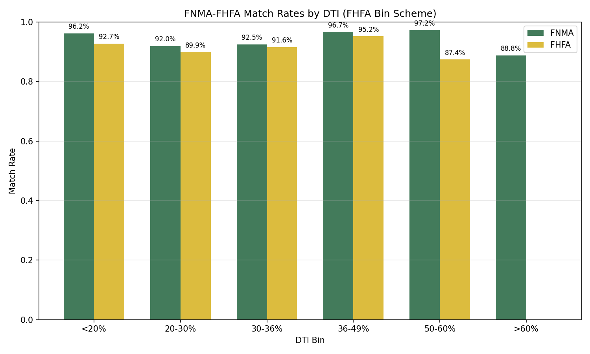

Match rates by FHFA DTI bin scheme are stable across debt-to-income levels, indicating no systematic bias toward borrowers with lower or higher debt burdens.

#### Loan Purpose

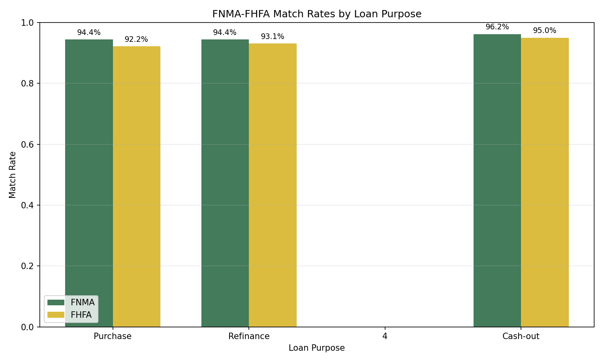

Purchase, refinance (no cash-out), and cash-out refinance loans match at similar rates across years.

#### Channel

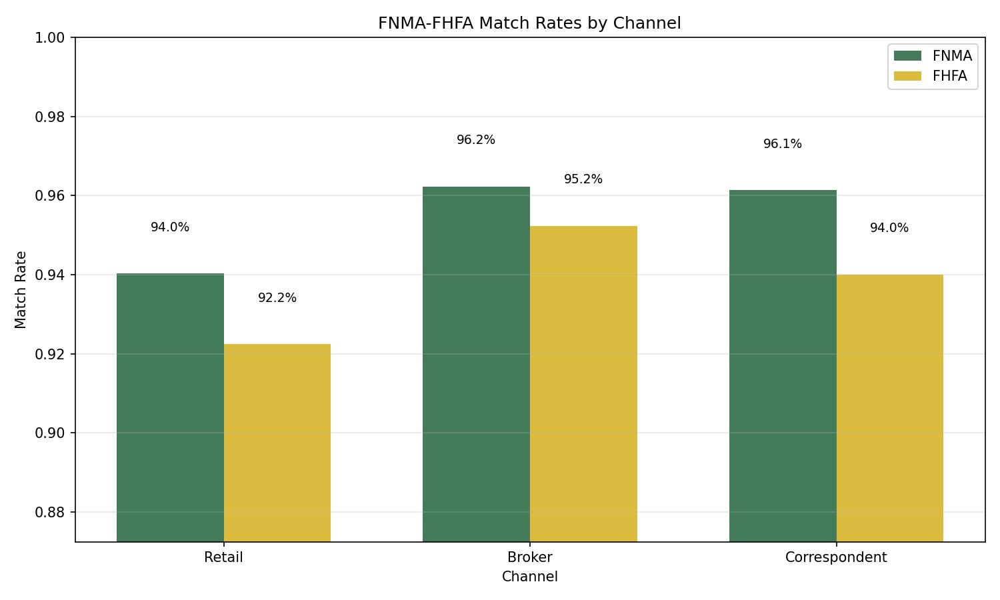

Match rates by origination channel (Retail, Broker, Correspondent) are consistent across all channels.

#### Occupancy

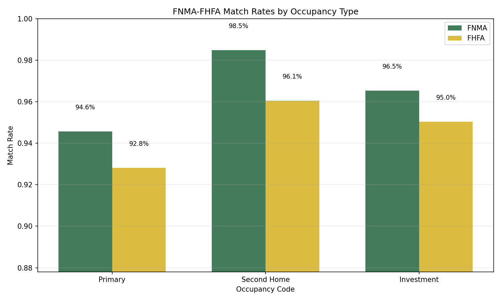

Match rates by occupancy type (Primary Residence, Second Home, Investment Property) are consistent across all categories.

### FNMA Validation Summary

Overall match statistics (2019-2024):
- **14.9M matched pairs** from 15.7M FNMA loans and 16.0M FHFA records
- **FNMA match rate**: 94.8%
- **FHFA match rate**: 93.0%

The stable match characteristics across all dimensions indicate the matched sample is representative of the underlying FNMA-FHFA overlap population.

---

### FHLMC-FHFA Validation

#### Temporal Analysis

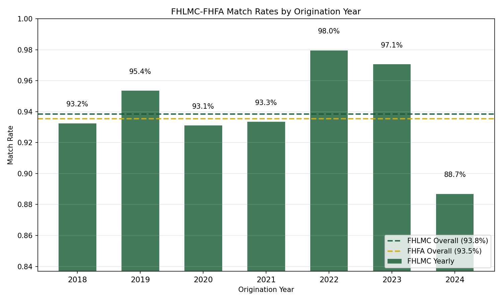

Match rates by origination year show stability across 2019-2024. With MSA crosswalk mapping and term binning implemented, the overall FHLMC match rate is 93.9% and FHFA match rate is 93.5%.

Note: Year-by-year FHFA match rates range from 91-97%, with 2022-2024 showing higher rates (96-97%) than 2019-2021 (91-93%) due to lower refi volumes in recent years.

#### Loan Amount

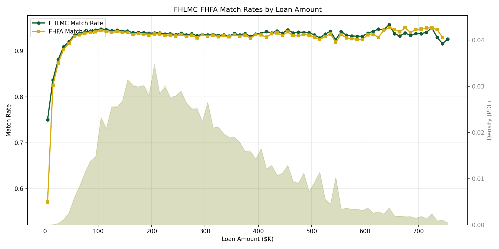

Match rates remain stable across the loan amount distribution.

#### LTV/CLTV

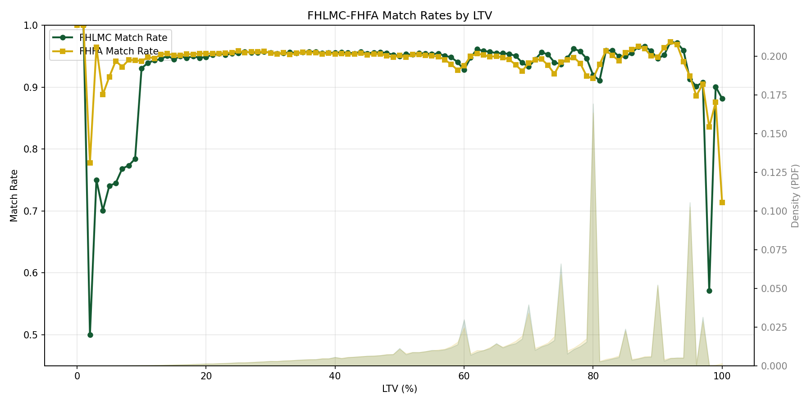

Match rates show consistency across the LTV/CLTV spectrum from 20-97%, with rates stable at ~90-95%.

**Key finding**: Match rates drop sharply at LTV >97%, confirming that FHLMC excludes high-LTV products (Home Possible, etc.) from their public disclosure. The matching uses CLTV when available to align with FHFA's reporting of "CLTV where available."

#### Interest Rate

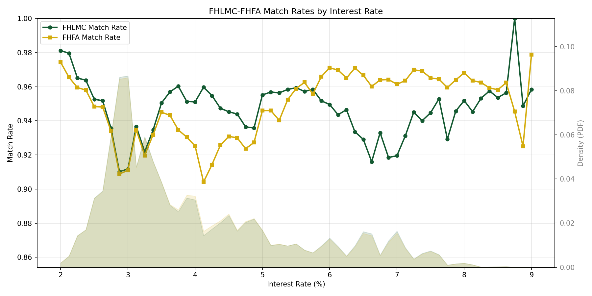

Match rates demonstrate stability across the rate distribution for 2019-2024, showing a bimodal distribution: low rates (2.5-4%) from the 2020-2021 refi boom and higher rates (6-8%) from 2022-2024.

#### DTI, Loan Purpose, Channel, Occupancy

Similar validation figures show stable match rates across DTI levels, loan purposes, origination channels, and occupancy types.

### FHLMC Validation Summary

Overall match statistics (2019-2024, with MSA crosswalk and term binning):
- **12.7M raw matched pairs → 12.66M after dedup** from 13.4M unique FHLMC loans (2019-2024) and 13.5M FHFA records
- **FHLMC match rate**: 93.9% (of unique FHLMC loans)
- **FHFA match rate**: 93.5% (of FHFA Freddie Mac records)

The stable match rates across loan characteristics indicate the matched sample is representative of the FHLMC-FHFA overlap population. The ~6% unmatched rate likely includes:
- High-LTV affordable products not in FHLMC disclosure (~1.5% identifiable)
- Non-disclosed loan types (portfolio, special programs) — not identifiable
- Matching algorithm gaps — not separately quantifiable from non-disclosed loans

## Related Workflows

- **[MBS-FHLB Matching](mbs_fhlb_matching.md)**: GNMA/FNMA to FHLB AMA matching
- **[FHFA MF-HMDA Analysis](fhfa_mf_hmda_matching.md)**: Analysis of why FHFA multifamily matching is problematic
