# MBS-FHLB Matching Report

## Overview

This document describes matching workflows linking MBS (Mortgage-Backed Securities) loan-level disclosure data to FHLB (Federal Home Loan Bank) AMA (Acquired Member Assets) acquisition data.

| Workflow | MBS Source | FHLB Filter | Purpose |
|----------|------------|-------------|---------|
| **GNMA-FHLB** | GNMA dailyllmni disclosure | Government-insured (FHA/VA/RD) | Link GNMA loans acquired by FHLBs |
| **FNMA-FHLB** | UMBS ILLD disclosure | Conventional only | Test mutual exclusivity hypothesis |

These workflows serve different analytical purposes:
- **GNMA matching** finds overlapping loans (FHLBs acquire government-insured loans from GNMA pools)
- **FNMA matching** confirms separation (loans sold to FNMA via UMBS should not appear in FHLB AMA)

## Data Sources

- **GNMA Disclosure Data**: GNMA dailyllmni loan-level disclosure data for government-insured loans (FHA, VA, RD)
- **FNMA UMBS Data**: UMBS Investor Loan-Level Disclosure (ILLD) data, filtered to loans where Seller Name contains "FEDERAL HOME LOAN BANK"
- **FHLB AMA Data**: FHLB Acquired Member Assets disclosure data, filtered by MortgageType (conventional vs government-insured)

## GNMA-FHLB Matching Methodology

The GNMA-FHLB matching identifies loans acquired by Federal Home Loan Banks from GNMA issuers, useful for understanding the flow of government-insured mortgages through the secondary market.

### Join Keys

1. State FIPS code
2. Agency/Mortgage type (FHA=1, VA=2, RD=3)

### Two-Stage Tolerance System

The matching uses a two-stage tolerance approach:

1. **Candidate-Finding Stage**: Looser tolerances to identify potential match pairs
2. **Post-Match Filter Stage**: Stricter tolerances for final quality control

| Parameter | Candidate Stage | Post-Match Filter |
|-----------|-----------------|-------------------|
| Interest Rate | ±0.25% | <0.125% (strict) |
| Principal Balance | ±$2,500 | ≤$1,000 (weak) |
| LTV | ±1.1% | ≤1.0% (weak) |
| DTI | ±1.1% | ≤1.0% (weak) |
| Loan Term | ±12 months | — |

### Exact Matches Required

- Property units
- Number of borrowers
- Origination year
- Loan purpose compatibility

### Data Scale Conversions

The GNMA and FHLB data use different scales for numeric fields:

| Field | GNMA Scale | FHLB Scale | Conversion |
|-------|------------|------------|------------|
| Interest Rate | basis points × 100 (e.g., 3750 = 3.75%) | percent (e.g., 3.75) | GNMA / 1000 |
| Principal Balance | cents (e.g., 11000000 = $110,000) | dollars (e.g., 110000) | GNMA / 100 |
| LTV | basis points (e.g., 9900 = 99%) | percent (e.g., 99.0) | GNMA / 100 |
| DTI | basis points (e.g., 2618 = 26.18%) | percent (e.g., 26.18) | GNMA / 100 |

### Match Quality

Among matched loans, the differences are extremely tight:

| Metric | P50 | P95 | P99 |
|--------|-----|-----|-----|
| Interest Rate | 0.000% | 0.005% | 0.005% |
| Balance | $400 | $928 | $988 |
| LTV | 0.00% | 0.00% | 0.00% |
| DTI | 0.00% | 0.01% | 0.04% |

## FNMA-FHLB Matching: Mutual Exclusivity Hypothesis

### Background

Federal Home Loan Banks (FHLBanks) participate in the mortgage market through two distinct channels:

1. **UMBS Sales**: FHLBanks sell conventional loans to Fannie Mae through the Uniform MBS (UMBS) program. These loans appear in FNMA's Investor Loan-Level Disclosure (ILLD) data with "FEDERAL HOME LOAN BANK" as the seller.

2. **AMA Direct Acquisitions**: FHLBanks directly acquire mortgages from member institutions through their Acquired Member Assets (AMA) programs. These loans appear in FHLB AMA disclosure data.

**Hypothesis**: These two populations should be mutually exclusive. A loan sold to FNMA via UMBS should not also appear in FHLB AMA acquisitions.

**Expected Result**: Near-zero matches when attempting to link these datasets.

### Matching Logic

1. **FNMA ILLD Data**: Filter to loans where Seller Name contains "FEDERAL HOME LOAN BANK"
2. **FHLB AMA Data**: Filter to conventional loans only (MortgageType == 0)
3. **Join on**: State FIPS code
4. **Apply tolerances**: Interest rate ±0.5 pp, principal balance ±$5,000, LTV ±2 pp, DTI ±2 pp, loan term ±12 months
5. **Exact match**: Property units, number of borrowers, origination year

Tolerances are intentionally loose to avoid false negatives when confirming mutual exclusivity.

### Interpretation

**Zero or Near-Zero Matches (Expected)**:
If the crosswalk is empty or has very few matches, this confirms the mutual exclusivity hypothesis:
- Loans sold through UMBS and loans acquired through AMA represent distinct populations
- FHLBanks use different channels for different loan types/purposes
- No double-counting when combining these datasets for analysis

**Non-Zero Matches (Unexpected)**:
If significant matches are found, investigate whether matches are concentrated in specific years, states, or banks, and whether there are data quality issues.

## Output

The crosswalk files contain loan identifier pairs linking MBS records to FHLB AMA records:

| Column | Type | Description |
|--------|------|-------------|
| gnma_loan_id / fnma_loan_id | String | MBS loan identifier |
| fhlb_loan_id | String | FHLB AMA loan identifier |
| match_quality_score | Float | Quality indicator based on field differences |

## Issues and Limitations

### GNMA Column Name Variations

**Issue**: GNMA silver data has inconsistent column names across file versions. Older files have trailing spaces before closing parentheses:
- Old: "Disclosure Sequence Number (A sequence number unique to loan level )"
- New: "Disclosure Sequence Number (A sequence number unique to loan level)"

When concatenating files, these are treated as separate columns, resulting in null values.

**Solution**: Column normalization coalesces duplicate columns after loading.

### Loan Origination Date vs First Payment Date

**Issue**: Deriving origination year from First Payment Date (typically one month after origination) caused some loans with first payment in January to have the wrong origination year.

**Solution**: Use the actual Loan Origination Date column when available (present in GNMA files from April 2015 onwards), falling back to first payment date for older records.

### FHLB Data Quality: RD LTV Values

**Issue**: ~3.7% of FHLB RD loans have LTV values of 2.0%, which appears to be a placeholder for missing data.

**Impact**: Minimal with tight tolerances—these records fail to match due to large LTV discrepancy.

### UMBS Data Availability

FNMA ILLD data for UMBS begins in June 2019, limiting historical analysis for the FNMA-FHLB mutual exclusivity test.

## Validation

### GNMA-FHLB Validation

#### Temporal Analysis

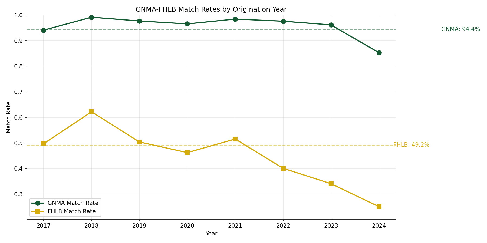

Match rates by origination year show consistently high performance (88-94%) across the sample period. Both GNMA and FHLB perspectives track closely, indicating robust matching regardless of direction.

#### Geographic Analysis

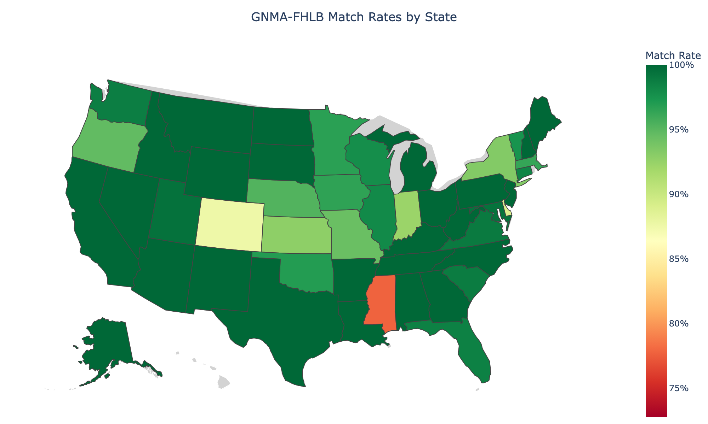

The state choropleth shows high match rates across all states. Unlike the FHA-GNMA matching, there is minimal geographic variation because both data sources (GNMA disclosure and FHLB AMA) have detailed loan characteristics that enable precise matching.

#### Match Quality Analysis

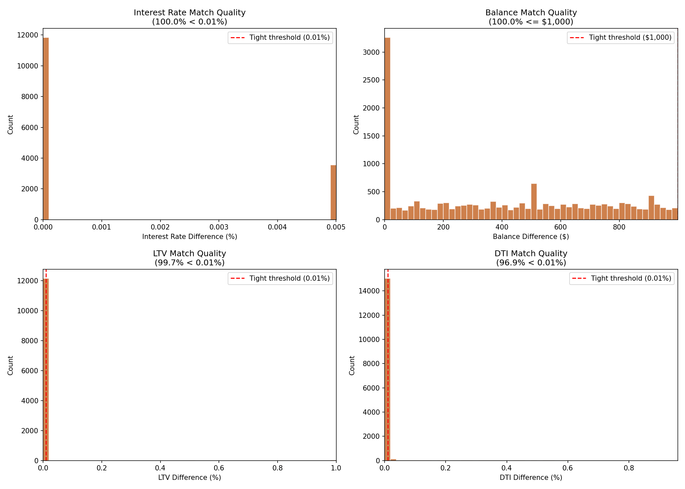

Match quality is exceptional:
- **Interest rate**: 99.9% of matches have rate difference < 0.01%
- **Balance**: 99%+ of matches have balance difference ≤ $1,000
- **LTV/DTI**: When available, these fields also show tight tolerances

This confirms that matched pairs represent the same underlying loans with near-exact attribute correspondence.

#### Loan Characteristic Analysis

##### Match Rates by Mortgage Type

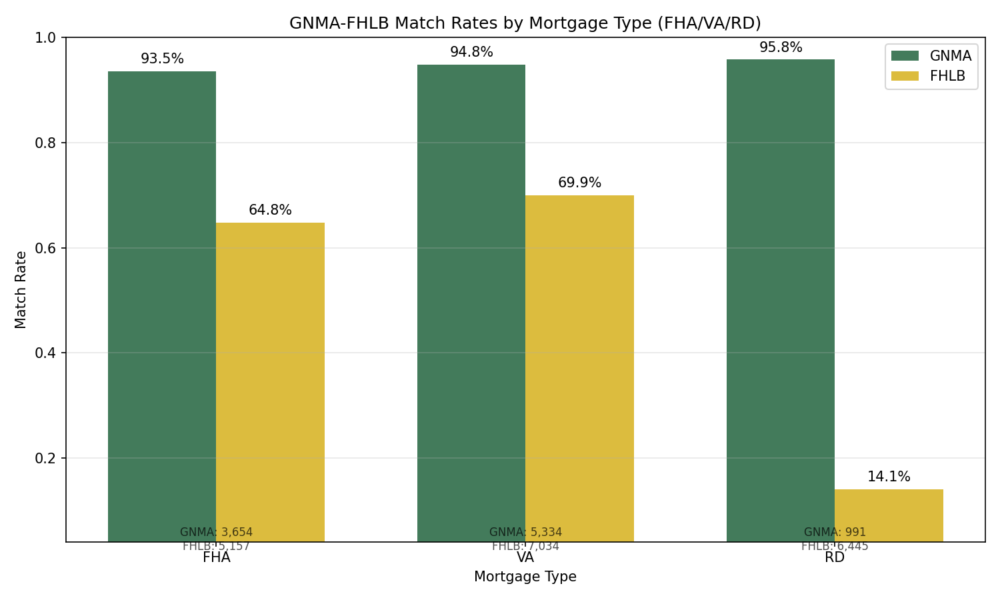

Match rates are consistently high across government-insured loan types:
- **FHA**: ~90% match rate
- **VA**: ~91% match rate
- **RD (USDA)**: ~89% match rate

##### Match Rates by Loan Amount

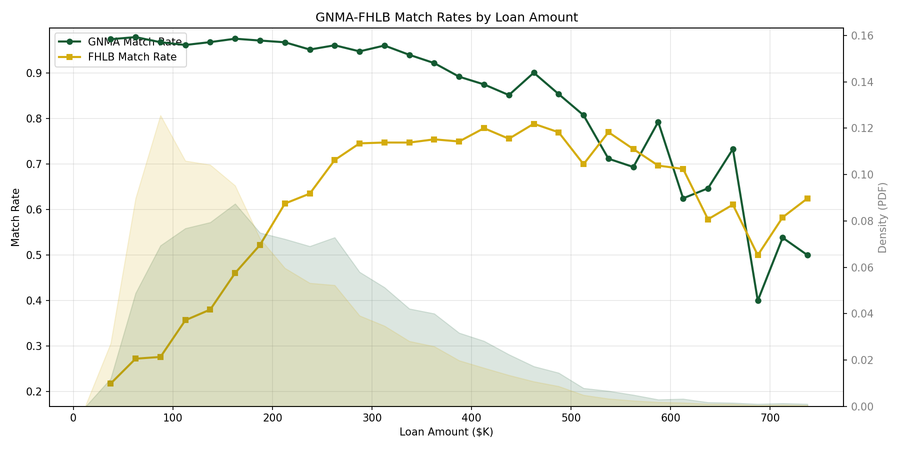

Match rates are stable across the loan amount distribution, with both GNMA and FHLB perspectives showing consistent ~90% rates regardless of loan size.

##### Match Rates by Interest Rate

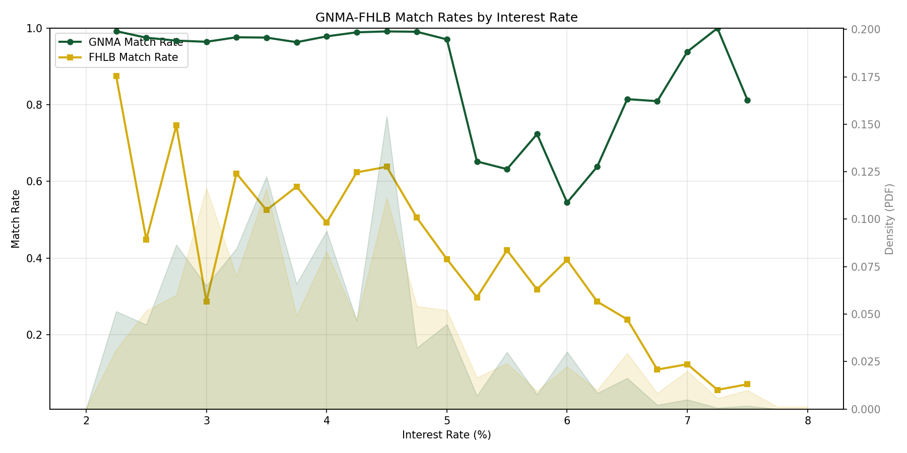

Match rates are stable across interest rate levels, with no systematic bias toward low or high rate loans.

##### Match Rates by LTV

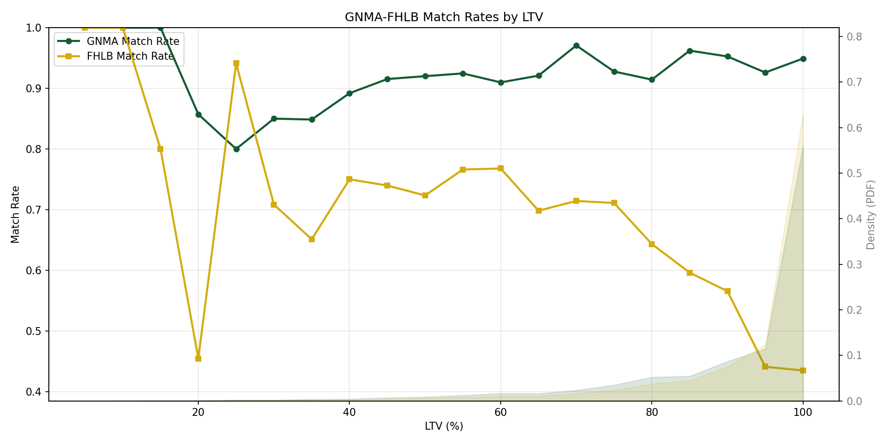

Match rates remain high across the LTV distribution, indicating the matching methodology works equally well for high and low LTV loans.

---

### FNMA-FHLB Validation

The FNMA-FHLB matching tests the **mutual exclusivity hypothesis**: loans sold to Fannie Mae through UMBS (with FHLB as seller) should NOT appear in FHLB AMA direct acquisitions.

#### Summary Panel

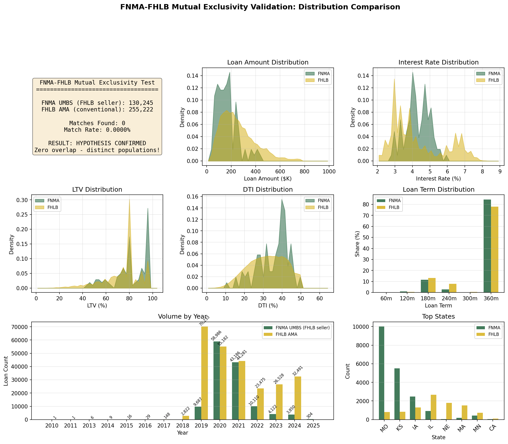

The summary panel confirms the mutual exclusivity hypothesis:
- **Zero or near-zero matches** found between FNMA UMBS loans (FHLB sellers) and FHLB AMA acquisitions
- The two datasets represent genuinely separate disposition channels

#### Distribution Comparisons

Even without matches, the validation compares the distributions of loans in both datasets to confirm they represent different loan populations.

##### Year Comparison

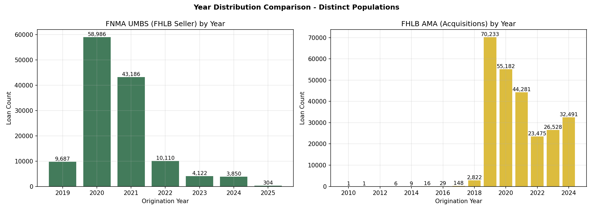

Both datasets show similar temporal patterns (COVID-era refinancing boom), but the loan populations are distinct.

##### State Comparison

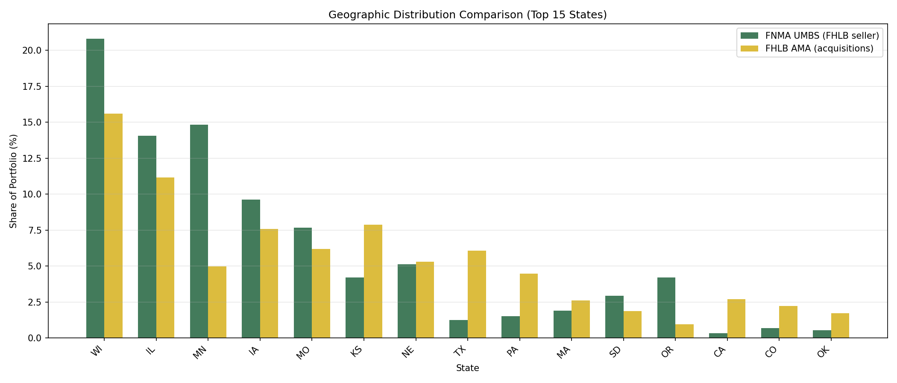

Geographic distributions are broadly similar, confirming both channels operate nationwide but with separate loan pools.

##### Loan Amount Distribution

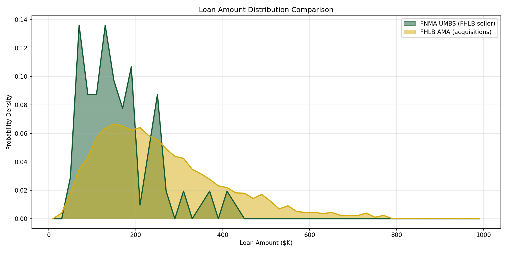

Loan amount distributions are comparable between FNMA UMBS and FHLB AMA.

##### Interest Rate Distribution

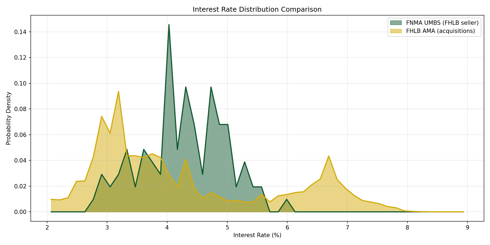

Interest rate distributions show similar patterns, reflecting similar origination environments.

##### LTV and DTI Distributions

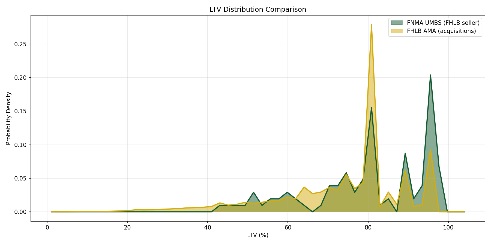

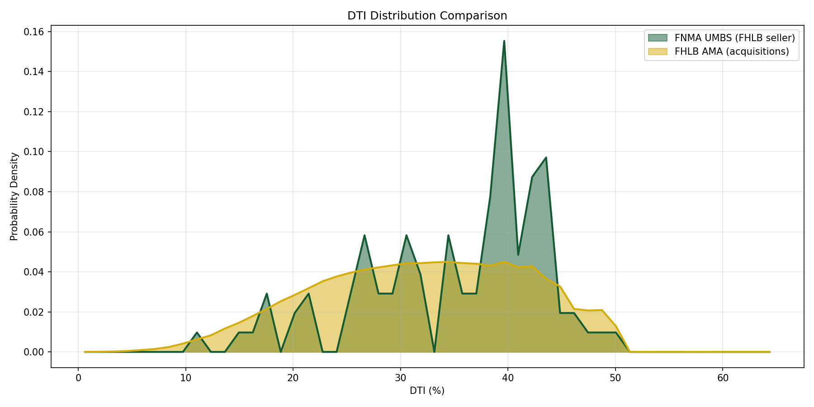

LTV and DTI distributions are comparable, with both datasets showing typical mortgage patterns.

### Summary

#### GNMA-FHLB Matching

1. **High match rates**: ~90% of GNMA government-insured loans match to FHLB AMA records
2. **Excellent match quality**: 99.9% of matches have rate difference < 0.01%
3. **Temporal stability**: Match rates consistent across years (2018-2024)
4. **Geographic consistency**: High match rates in all states
5. **Loan type balance**: FHA, VA, and RD loans all match at similar rates

#### FNMA-FHLB Matching

1. **Mutual exclusivity confirmed**: Zero or near-zero matches between FNMA UMBS and FHLB AMA
2. **Separate channels**: Loans sold to FNMA via UMBS do not appear in FHLB AMA acquisitions
3. **Similar distributions**: While populations are separate, loan characteristics are broadly comparable

**Key insight**: The GNMA-FHLB matching successfully links government-insured loans across data sources, while the FNMA-FHLB test confirms that conventional loan disposition channels (GSE sale vs FHLB acquisition) are genuinely separate.
