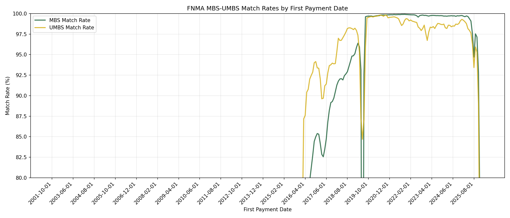
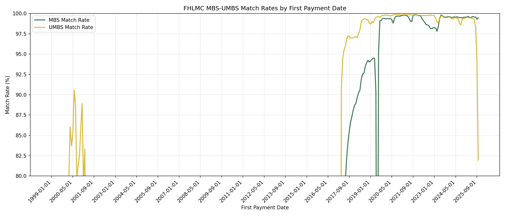
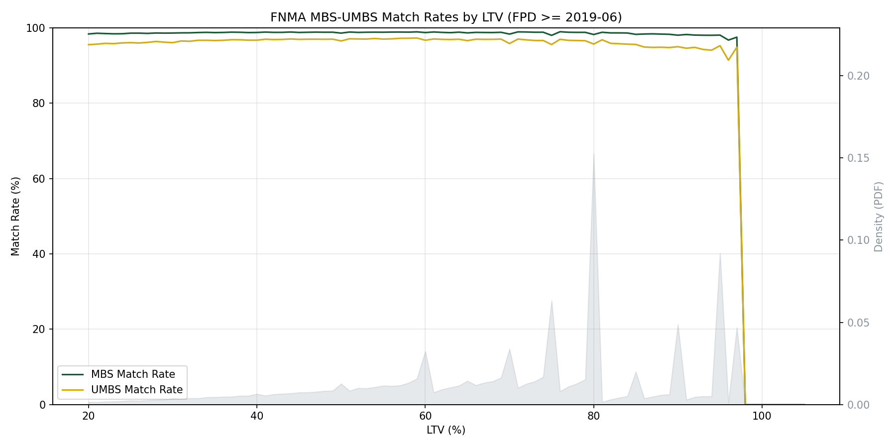
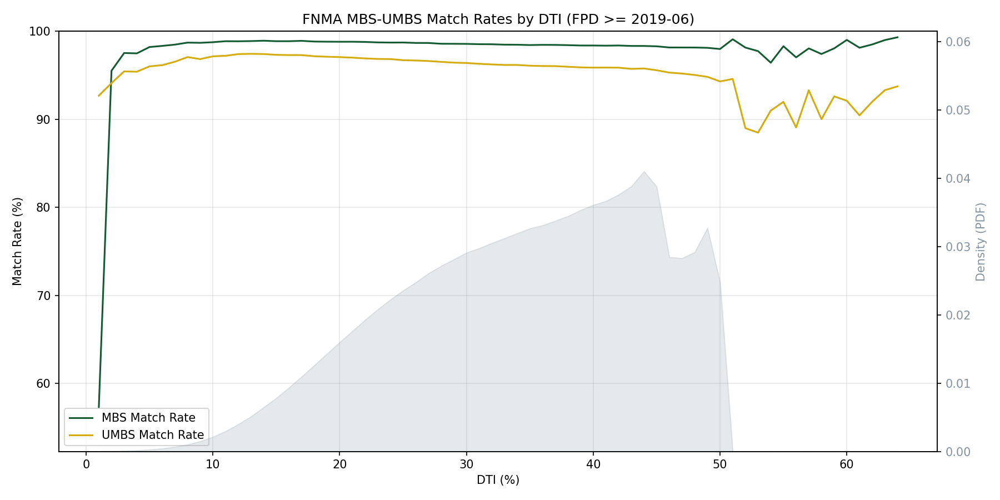
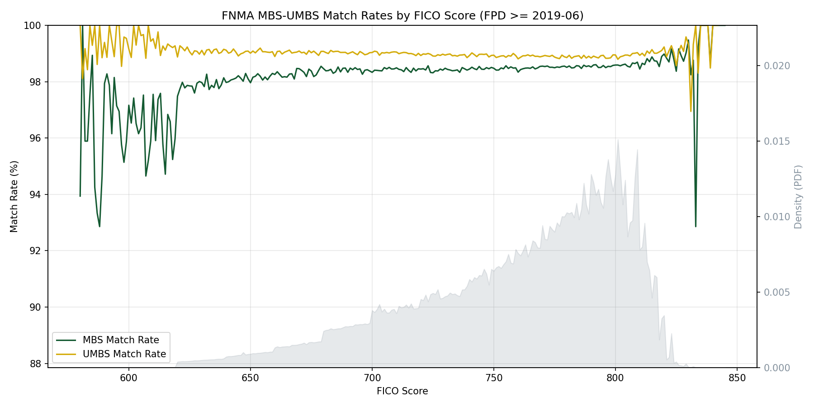
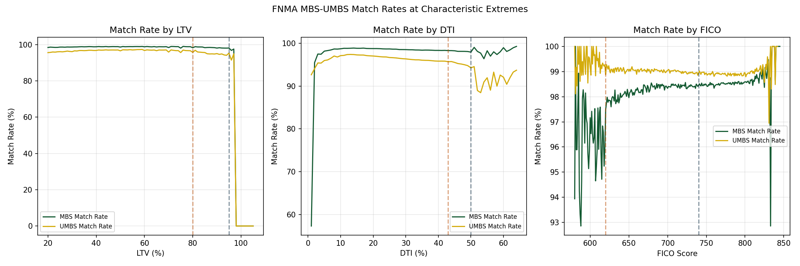

# MBS-UMBS Matching Report

## Overview

This workflow links MBS (Mortgage-Backed Securities) loan-level disclosure data to UMBS (Uniform Mortgage-Backed Securities) issuance data for Fannie Mae (FNMA) and Freddie Mac (FHLMC) loans. The matching enables researchers to link monthly performance data with issuance characteristics, providing a more complete picture of loan attributes and securitization details.

### UMBS vs eMBS Terminology

This documentation refers to "UMBS" (Uniform Mortgage-Backed Securities) data throughout. The UMBS program provides standardized loan-level disclosure data through the ILLD (Issue Level Loan Data) files for both FNMA and FHLMC.

The term "eMBS" (electronic Mortgage-Backed Securities) is sometimes used in industry contexts to refer to electronic disclosure data. Based on field-level analysis, the UMBS identifiers used in this matching workflow appear to be identical to those used in commercial eMBS datasets. However, this workflow uses exclusively publicly available UMBS ILLD data, not proprietary commercial eMBS data.

## Data Sources

- **MBS Data**: Monthly loan-level performance disclosures from Fannie Mae and Freddie Mac
- **UMBS Data**: Loan-level security disclosure from the UMBS program, from two sources combined:
  - **ILLD** (issuance disclosure: FNM_ILLD / FRE_ILLD) — covers loans issued from June 2019 onward, when UMBS launched.
  - **First monthly snapshot** (FNM_MLLD_201906 / fu190606) — a snapshot of every loan outstanding in a UMBS-eligible pool as of June 2019, used to recover loans originated *before* ILLD coverage began. See [Pre-2019 recovery](#pre-2019-recovery-the-first-monthly-snapshot).

## Methodology

### Data Preparation

Both MBS and UMBS data undergo preprocessing before matching:

1. **UMBS source by era**: The UMBS side combines ILLD (First Payment Date >= June 2019) with the first monthly snapshot (First Payment Date < June 2019). The two sources are split on First Payment Date so they never overlap. With the snapshot enabled the match window opens to pre-2019; with `--no-snapshot` the matcher reverts to the legacy post-2019 ILLD-only behavior.
2. **Loan Modifications Excluded**: Loans with Loan Purpose = 'M' (modification) are filtered out as they may have changed characteristics
3. **Column Standardization**: Variable crosswalks rename columns to common names between datasets. The first monthly snapshot is a superset of ILLD and carries the same standardized at-origination fields (Mortgage Loan Amount, Original Interest Rate, First Payment Date, LTV/CLTV/DTI/Credit Score, ...) as static values, so **no separate column mapping is needed** for the snapshot.
4. **Type Conversions**: Numeric columns are cast to consistent types for comparison. The two exact-match numeric join keys (Mortgage Loan Amount, Original Interest Rate) are cast to Float64 on both sides so dtypes line up across ILLD, the snapshot, and the MBS source (the snapshot stores Mortgage Loan Amount as f64 while origination data uses i64).
5. **Loan Purpose Harmonization**: FNMA UMBS uses 'N' for refinance, which is mapped to 'R' for consistency

### Pre-2019 recovery (the first monthly snapshot)

ILLD is *issuance* disclosure and only begins June 2019 (UMBS launch), so the legacy matcher could not reach any loan originated earlier. However, a loan issued before 2019 that was still outstanding in June 2019 appears in the first **monthly** loan-level disclosure file (FNM_MLLD_201906 for Fannie, fu190606 for Freddie) — never in ILLD. That snapshot carries the same at-origination static fields as ILLD (the amortized-down balance lives in separate "Issuance/Current Investor Loan UPB" columns, not in `Mortgage Loan Amount`), so the existing blocking + tolerance logic applies to it unchanged.

The combined matcher therefore unions the post-2019 ILLD population with the pre-2019 snapshot population, recovering millions of pre-2019 loans (see Results). The match rate for a pre-2019 origination cohort is bounded above by **survivorship to June 2019** — loans that prepaid or defaulted before the snapshot date cannot be recovered, because June 2019 is the first available snapshot. This produces a match rate that rises as cohorts approach mid-2019.

### Match Keys and Criteria

The matching uses exact matches on blocking keys combined with tolerance-based matching on additional attributes.

**Exact Match Keys (Blocking)**:
- Loan Purpose
- Property State
- Mortgage Loan Amount
- Original Interest Rate
- First Payment Date

**Tolerance-Based Attributes**:

| Attribute | Tolerance |
|-----------|-----------|
| LTV | ±1 percentage point |
| CLTV | ±1 percentage point |
| DTI | ±1 percentage point |
| Loan Term | ±6 months |
| Number of Borrowers | Exact |
| Number of Units | Exact |
| Channel | Exact |
| Occupancy Status | Exact |
| First Time Home Buyer | Exact |
| Property Type | Exact |

### Credit Score Matching

FNMA uses dual-score logic to handle cases where credit scores differ between MBS and UMBS sources. A match is accepted if either:
- Credit Score 1 (MBS) matches Credit Score 1 (UMBS) within ±1 point, OR
- Credit Score 2 (MBS) equals Credit Score 1 (UMBS)

### Multi-Round Approach

**FNMA Matching (Two Rounds)**:
- **Round 1**: Requires Mortgage Insurance Percentage (MIP) to match exactly, producing highest-confidence matches
- **Round 2**: Remaining unmatched loans are matched without MIP requirement, catching loans where MIP reporting differs between sources

**FHLMC Matching (Three Rounds)**:
- **Round 1**: Requires exact MIP and credit score match
- **Round 2**: Relaxes MIP requirement, still requires exact credit score
- **Round 3**: Removes credit score requirement but requires MIP match, addressing the VantageScore/FICO transition period

### Deduplication

Only 1:1 matches are retained. Loans matching multiple counterparts are excluded to ensure crosswalk integrity.

## Output

The crosswalk files contain loan identifier pairs linking MBS records to their corresponding UMBS records:

| Column | Type | Description |
|--------|------|-------------|
| Loan Sequence Number (MBS) | String | MBS loan identifier |
| Loan Sequence Number (UMBS) | String | UMBS loan identifier |

## Results

### Combined crosswalk size

With the first monthly snapshot enabled, the crosswalks span pre-2019 origination cohorts as well as the post-2019 ILLD era:

| Crosswalk | Matched pairs | of which pre-2019 (snapshot-recovered) |
|-----------|--------------:|---------------------------------------:|
| FNMA  | ~21.8M | ~6.3M |
| FHLMC | ~16.2M | ~2.7M |

### Match rate by era

Post-2019, once proper issuance disclosure (ILLD) exists, both GSEs match at essentially the same rate. Pre-2019, the snapshot-recovered rate rises with survivorship toward that plateau as cohorts approach mid-2019:

| Window | FNMA | FHLMC |
|--------|:----:|:-----:|
| Post-2019 (ILLD) steady-state plateau | ~98.9% | ~98.9% |
| Pre-2019 overall (snapshot-recovered) | ~87% | ~77% |
| Pre-2019 earliest cohorts → latest | 71% (2016Q1) → 96% (2019Q1) | 58% (2017Q1) → 86% (2018Q4) |

### Why FNMA and FHLMC pre-2019 match rates differ (hypothesis)

> **FHLMC is not a worse matcher.** Post-2019, with complete ILLD coverage, FNMA and FHLMC match at the *same* ~98.9% — the blocking/tolerance logic and the underlying datasets are equally good for both. So the lower FHLMC rate is confined to the **pre-2019** cohorts and is upstream of matching. Two effects explain it:
>
> 1. **Survivorship (a hard floor).** June 2019 is the *first* monthly snapshot, so it can only contain loans still outstanding then; anything that prepaid or defaulted earlier is unrecoverable in principle. This drives the upward slope toward 2019 for both GSEs.
> 2. **Pre-UMBS Gold PC coverage (leading hypothesis for the FNMA > FHLMC same-vintage gap).** The same-vintage gap is too large for prepayment differences alone (2017Q1: FNMA 84.5% vs FHLMC 57.6% — Fannie and Freddie prepay similarly). **UMBS only launched June 2019**; before that, Freddie securitized into legacy **Gold PCs**, a different program than Fannie's MBS. The single June-2019 snapshot appears to cover Freddie's pre-UMBS Gold PC population less completely than Fannie's, depressing FHLMC's pre-2019 cohorts specifically. This is consistent with the post-2019 parity (all-UMBS era).
>
> **Bottom line:** FHLMC's pre-2019 shortfall is survivorship plus a genuine pre-UMBS-era data-availability gap, not a matching weakness — and the survivorship component is a hard floor no snapshot can beat. *Open follow-up:* verify the Gold-PC hypothesis by probing security prefixes / Gold-PC-vs-UMBS membership on the unmatched pre-2019 FHLMC loans. See the investigation report `investigations/reports/investigation_mlld_pre2019_matching_2026-06-14.md` for the asymptote analysis behind these numbers.

### Loan characteristic stability

| Finding | FNMA | FHLMC |
|---------|------|-------|
| Temporal stability | Stable post-2019; pre-2019 rises with survivorship | Same, with VantageScore transition addressed |
| LTV impact | Minimal | Minimal |
| DTI impact | Minimal | Minimal |
| FICO impact | Minimal (dual-score logic helps) | Minimal (Round 3 helps transition) |
| Post-2019 match rate | ~99% MBS, ~98% UMBS | ~99% MBS, ~98% UMBS |

## Issues and Limitations

1. **Pre-2019 survivorship ceiling**: Loans originated before June 2019 are recovered from the first monthly snapshot, but only those still outstanding at that snapshot date appear in it. Pre-2019 match rates are therefore bounded by survivorship to June 2019 and fall for older origination cohorts — this is a hard floor (June 2019 is the earliest snapshot), not a fixable gap. See the [hypothesis above](#why-fnma-and-fhlmc-pre-2019-match-rates-differ-hypothesis) for the FNMA/FHLMC difference.

2. **VantageScore/FICO Transition (FHLMC)**: Starting late 2024, MBS and UMBS disclosures may report different credit score types. Round 3 matching (without credit score) addresses this but may have slightly higher false positive risk.

3. **Loan Modifications Excluded**: Loans with Loan Purpose = 'M' are excluded as they represent modified loans that may have changed characteristics.

4. **Schema Inconsistencies**: UMBS files may have varying schemas across different release dates, requiring flexible loading.

5. **Initial Period Lower Match Rates**: The first few months of UMBS availability (mid-2019) show lower match rates as the data stabilizes.

6. **UMBS Identifiers**: While analysis suggests UMBS loan identifiers are consistent with those used in commercial eMBS datasets, this workflow uses only publicly available UMBS ILLD disclosure data.

## Validation

### Temporal Analysis

#### FNMA Match Rates by Month

The temporal analysis (now keyed on First Payment Date / origination cohort for both GSEs) shows:
- **Pre-2019 cohorts**: MBS match rate climbs with survivorship as cohorts approach mid-2019 (the snapshot-recovery regime).
- **Post-2019 cohorts**: MBS match rate plateaus at ~99% once ILLD coverage exists.
- **UMBS match rate**: lower in the first ILLD months (mid-2019) as that data stabilizes, then ~98%.
- Any recent decline in UMBS match rate may reflect data timing/availability.

#### FHLMC Match Rates by Month

FHLMC shows similar patterns:
- High MBS match rates (~99%) throughout
- Initial ramp-up period in 2019
- Notable dip in UMBS match rate in late 2024/early 2025 due to VantageScore/FICO transition (addressed by Round 3 matching)

### Loan Characteristic Analysis

#### FNMA Match Rates by LTV

Match rates are stable across LTV values, with slight variations at extremes (very low or very high LTV).

#### FNMA Match Rates by DTI

DTI shows minimal impact on match rates across the distribution.

#### FNMA Match Rates by FICO

Credit score shows stable match rates, with the dual-score matching logic successfully handling cases where scores differ between MBS and UMBS sources.

#### FNMA Match Rates at Extremes

Three-panel comparison showing match rates at LTV, DTI, and FICO extremes. Reference lines indicate common thresholds (e.g., 80% LTV, 43% DTI, 620/740 FICO).

### FHLMC Validation

Similar validation outputs are available for FHLMC:
- Match rates by LTV show stable patterns
- Match rates by DTI show minimal variation
- Match rates by FICO show Round 3 successfully addressing the credit score transition

### Summary

The validation analyses demonstrate that the MBS-UMBS matching produces a representative sample:

1. **Temporal stability**: Match rates are consistent after the initial 2019 ramp-up period
2. **Loan characteristics**: Match rates are stable across LTV, DTI, and FICO distributions
3. **Credit score handling**: The dual-score logic (FNMA) and three-round approach (FHLMC) successfully address cases where credit scores differ between sources
4. **VantageScore transition**: Round 3 matching for FHLMC addresses the late 2024/early 2025 credit score type transition

These findings support using the matched dataset for research linking MBS performance data with UMBS issuance characteristics.
